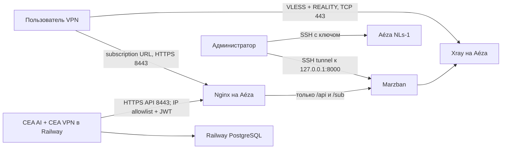
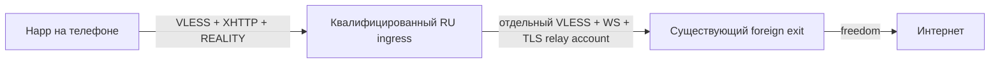

# CEA VPN: runbook первого сервера

Статус документа: обновлён 29 июля 2026 года. Это инструкция для отдельного
окна изменений; команды нового whitelist-режима требуют отдельного кандидата
ingress и ручной проверки на реально ограниченной мобильной сети.

## 1. Назначение и границы

Первый VPN-узел размещается на Aéza `NLs-1` в Амстердаме:

- 1 shared vCPU;
- 2 ГБ RAM;
- 30 ГБ NVMe;
- 1 публичный IPv4;
- канал 1 Гбит/с;
- обычный Shared-тариф, не Promo.

На VPS работают только Marzban, Xray и локальный Nginx. Оба Telegram-бота и
PostgreSQL остаются в существующем Railway-сервисе. Не переносить агрегатор на
VPS и не запускать второй экземпляр бота.

На момент написания `ceai/vpn_bot/handlers.py` является визуальным прототипом:
оплата и выдача VPN не реализованы. В репозитории уже подготовлены отдельные
VPN-таблицы и базовый клиент Marzban, но они ещё не подключены к обработчикам и
`ceai/config.py`. Добавление переменных в Railway само по себе ничего не
подключит. До отдельного изменения кода сохранять
`VPN_PROVISIONING_ENABLED=0` и не принимать реальные VPN-платежи.

Официальные источники:

- [тарифы Aéza](https://aeza.net/ru/virtual-servers);
- [установка Marzban](https://gozargah.github.io/marzban/en/docs/installation);
- [переменные Marzban](https://gozargah.github.io/marzban/en/docs/configuration);
- [Marzban REST API](https://gozargah.github.io/marzban/en/docs/api);
- [VLESS/REALITY в Marzban](https://gozargah.github.io/marzban/en/docs/core-settings);
- [актуальная спецификация REALITY](https://xtls.github.io/en/config/transports/reality.html);
- [минимальный официальный пример VLESS + XHTTP + REALITY](https://github.com/XTLS/Xray-examples/tree/main/VLESS-XHTTP-Reality/minimal-steal_others);
- [XHTTP: design, режимы и совместимость](https://github.com/XTLS/Xray-core/discussions/4113);
- [зафиксированный Xray-core v26.3.27](https://github.com/XTLS/Xray-core/releases/tag/v26.3.27);
- [обсуждение russia-whitelist #21](https://github.com/kort0881/russia-whitelist/discussions/21);
- [резервное копирование Marzban](https://github.com/Gozargah/Marzban#backup);
- [статический исходящий IP Railway](https://docs.railway.com/networking/static-outbound-ips);
- [sealed variables Railway](https://docs.railway.com/variables#sealed-variables).

## 2. Целевая схема



Публичные порты VPS:

| Порт | Назначение | Доступ |
|---|---|---|
| `22/tcp` | SSH | только административный IP; временно `ufw limit`, если IP динамический |
| `80/tcp` | ACME HTTP-01 | публичный, только `/.well-known/acme-challenge/` |
| `443/tcp` | VLESS + REALITY | публичный |
| `8443/tcp` | API и subscription URL через Nginx | `/api/` только с Railway IP; `/sub/` публичен по секретному токену |
| `8000/tcp` | Marzban | только `127.0.0.1`, никогда не открывать в firewall |
| `9443/tcp` | локальная cover-страница REALITY | только `127.0.0.1` |

## 3. Стоп-условия до покупки и установки

Не начинать ввод в эксплуатацию, пока не выполнено всё ниже:

1. Поддержка Aéza письменно подтвердила, что на `NLs-1` допустимо оказывать
   платный VPN конечным пользователям при соблюдении AUP и обработке abuse.
2. Изучены действующие требования законодательства для коммерческого VPN,
   политика конфиденциальности, оферта и порядок ответа на abuse-жалобы.
3. Есть отдельная учётная запись Aéza с 2FA, а не общий пароль команды.
4. Есть SSH-ключ администратора Ed25519; приватный ключ не отправлялся в чат.
5. Есть домен и четыре DNS-only A-записи на IPv4 VPS:
   `vpn1.example.com`, `panel-vpn1.example.com`, `sub-vpn1.example.com`,
   `cover-vpn1.example.com`. Заменить `example.com` во всём runbook.
6. Для Railway включён Static Outbound IP на Pro-плане либо заранее выбран
   защищённый туннель/mTLS. Без этого API Marzban не открывать в интернет.
7. Назначен внешний зашифрованный backup storage, не находящийся на этом VPS.
8. Токен `@ceavpn_bot`, если он когда-либо попадал в чат, лог или документ,
   отозван в BotFather и заменён в Railway.

## 4. Создание VPS

В панели Aéza выбрать:

- локацию Amsterdam;
- тариф `NLs-1`, не Promo;
- Debian 12 x86_64;
- вход по SSH-ключу;
- hostname `cea-vpn-nl1`;
- резервные копии и автопродление выключены на первом месяце; уведомление о
  низком балансе включить в аккаунте.

Сразу записать в менеджер секретов: ID сервера, IPv4, дату оплаты, тариф и
контакт владельца. Не хранить root-пароль в репозитории.

## 5. Базовая защита Debian

Все команды ниже выполняются вручную после подстановки значений. Сначала
проверить доступ к web/VNC-консоли Aéza — это путь восстановления при ошибке SSH.

```bash
export ADMIN_IP_CIDR="203.0.113.10/32"
sudo apt-get update
sudo apt-get dist-upgrade -y
sudo apt-get install -y ca-certificates curl jq nginx certbot ufw fail2ban unattended-upgrades needrestart
sudo timedatectl set-timezone UTC
sudo timedatectl set-ntp true
timedatectl status
```

Создать отдельного оператора. Перед отключением root обязательно открыть вторую
SSH-сессию и проверить `sudo -v`.

```bash
sudo adduser --disabled-password --gecos "" ceaops
sudo usermod -aG sudo ceaops
sudo install -d -m 0700 -o ceaops -g ceaops /home/ceaops/.ssh
sudo cp /root/.ssh/authorized_keys /home/ceaops/.ssh/authorized_keys
sudo chown ceaops:ceaops /home/ceaops/.ssh/authorized_keys
sudo chmod 0600 /home/ceaops/.ssh/authorized_keys
```

Создать `/etc/ssh/sshd_config.d/10-cea-hardening.conf`:

```text
PermitRootLogin no
PasswordAuthentication no
KbdInteractiveAuthentication no
PubkeyAuthentication yes
AuthenticationMethods publickey
AllowUsers ceaops
X11Forwarding no
AllowAgentForwarding no
AllowTcpForwarding local
PermitTunnel no
MaxAuthTries 3
LoginGraceTime 30
ClientAliveInterval 300
ClientAliveCountMax 2
```

Проверка и безопасное применение:

```bash
sudo sshd -t
sudo systemctl reload ssh
ssh ceaops@VPS_IPV4
sudo -v
```

Firewall сначала разрешает SSH, затем включается. Не закрывать текущую сессию,
пока новый вход не проверен.

```bash
sudo ufw default deny incoming
sudo ufw default allow outgoing
sudo ufw allow from "$ADMIN_IP_CIDR" to any port 22 proto tcp
sudo ufw allow 80/tcp
sudo ufw allow 443/tcp
sudo ufw allow 8443/tcp
sudo ufw deny out 25/tcp
sudo ufw enable
sudo ufw status verbose
sudo systemctl enable --now fail2ban
sudo fail2ban-client status sshd
```

Если административный IP динамический, временно использовать
`sudo ufw limit 22/tcp`, но заменить это на allowlist или административный VPN.
UFW должен работать с IPv6 (`IPV6=yes`), даже если AAAA-запись пока не создана.

Ограничить рост Docker-логов до установки Marzban. Создать
`/etc/docker/daemon.json` после появления Docker, не перезаписывая существующие
настройки:

```json
{
  "log-driver": "json-file",
  "log-opts": {"max-size": "10m", "max-file": "3"}
}
```

## 6. TLS и локальный Nginx

Сначала создать только HTTP-конфигурацию для ACME и получить сертификат.

```bash
sudo install -d -m 0755 /var/www/letsencrypt
```

`/etc/nginx/sites-available/cea-vpn` на первом этапе:

```nginx
server {
    listen 80;
    listen [::]:80;
    server_name panel-vpn1.example.com sub-vpn1.example.com cover-vpn1.example.com;

    location ^~ /.well-known/acme-challenge/ {
        root /var/www/letsencrypt;
    }
    location / { return 404; }
}
```

```bash
sudo ln -s /etc/nginx/sites-available/cea-vpn /etc/nginx/sites-enabled/cea-vpn
sudo rm -f /etc/nginx/sites-enabled/default
sudo nginx -t
sudo systemctl reload nginx
sudo certbot certonly --webroot -w /var/www/letsencrypt \
  -d panel-vpn1.example.com -d sub-vpn1.example.com -d cover-vpn1.example.com
sudo certbot renew --dry-run
```

После получения сертификата добавить в `http {}` файла `/etc/nginx/nginx.conf`:

```nginx
limit_req_zone $binary_remote_addr zone=marzban_api:10m rate=10r/s;
limit_req_zone $binary_remote_addr zone=marzban_sub:10m rate=3r/s;
```

Затем заменить конфигурацию сайта на шаблон ниже. Обязательно заменить домены и
`RAILWAY_STATIC_OUTBOUND_IP`; с плейсхолдером `nginx -t` должен считаться
непройденным.

```nginx
server {
    listen 80;
    listen [::]:80;
    server_name panel-vpn1.example.com sub-vpn1.example.com cover-vpn1.example.com;
    location ^~ /.well-known/acme-challenge/ { root /var/www/letsencrypt; }
    location / { return 404; }
}

server {
    listen 8443 ssl;
    server_name panel-vpn1.example.com;
    ssl_certificate /etc/letsencrypt/live/panel-vpn1.example.com/fullchain.pem;
    ssl_certificate_key /etc/letsencrypt/live/panel-vpn1.example.com/privkey.pem;
    ssl_protocols TLSv1.2 TLSv1.3;
    server_tokens off;

    location ^~ /api/ {
        allow RAILWAY_STATIC_OUTBOUND_IP;
        deny all;
        limit_req zone=marzban_api burst=30 nodelay;
        proxy_pass http://127.0.0.1:8000;
        proxy_set_header Host $host;
        proxy_set_header X-Real-IP $remote_addr;
        proxy_set_header X-Forwarded-For $proxy_add_x_forwarded_for;
        proxy_set_header X-Forwarded-Proto https;
        proxy_connect_timeout 5s;
        proxy_read_timeout 15s;
    }
    location / { return 404; }
}

server {
    listen 8443 ssl;
    server_name sub-vpn1.example.com;
    ssl_certificate /etc/letsencrypt/live/panel-vpn1.example.com/fullchain.pem;
    ssl_certificate_key /etc/letsencrypt/live/panel-vpn1.example.com/privkey.pem;
    ssl_protocols TLSv1.2 TLSv1.3;
    server_tokens off;

    location ^~ /sub/ {
        access_log off;
        limit_req zone=marzban_sub burst=10 nodelay;
        proxy_pass http://127.0.0.1:8000;
        proxy_set_header Host $host;
        proxy_set_header X-Forwarded-Proto https;
        proxy_connect_timeout 5s;
        proxy_read_timeout 15s;
    }
    location / { return 404; }
}

server {
    listen 127.0.0.1:9443 ssl;
    server_name cover-vpn1.example.com;
    ssl_certificate /etc/letsencrypt/live/panel-vpn1.example.com/fullchain.pem;
    ssl_certificate_key /etc/letsencrypt/live/panel-vpn1.example.com/privkey.pem;
    ssl_protocols TLSv1.2 TLSv1.3;
    access_log off;
    default_type text/plain;
    return 200 "ok\n";
}
```

Railway предупреждает, что статический IP может быть общим с другими клиентами,
поэтому allowlist дополняет JWT-аутентификацию, а не заменяет её. Если Static
Outbound IP недоступен, не использовать `allow 0.0.0.0/0`: оставить API закрытым
до настройки mTLS, Cloudflare Access service token или другого защищённого
туннеля. Subscription URL остаётся публичным, поскольку его длинный токен является
секретом; поэтому URI не должен попадать в access log.

```bash
sudo nginx -t
sudo systemctl reload nginx
```

## 7. Проверяемая установка Marzban

Не выполнять `curl | bash` напрямую и не использовать `latest`. Во время окна
изменений выбрать стабильный релиз Marzban и полный commit SHA официального
installer-репозитория, сохранить их в change log и проверить release notes.

```bash
export MARZBAN_VERSION="vX.Y.Z"
export INSTALLER_COMMIT="FULL_40_CHARACTER_REVIEWED_COMMIT_SHA"
curl -fL "https://raw.githubusercontent.com/Gozargah/Marzban-scripts/${INSTALLER_COMMIT}/marzban.sh" \
  -o /tmp/marzban-install.sh
sha256sum /tmp/marzban-install.sh
less /tmp/marzban-install.sh
sudo bash /tmp/marzban-install.sh install --version "$MARZBAN_VERSION"
```

Для первого узла использовать SQLite: это официальный default и экономит RAM.
При нескольких узлах или необходимости HA отдельно планировать миграцию на
внешнюю БД. После установки зафиксировать Docker image digest в
`/opt/marzban/docker-compose.yml` вместо плавающего тега и сохранить digest в
change log.

В `/opt/marzban/.env` должны быть как минимум:

```env
UVICORN_HOST="127.0.0.1"
UVICORN_PORT=8000
XRAY_JSON="/var/lib/marzban/xray_config.json"
SQLALCHEMY_DATABASE_URL="sqlite:////var/lib/marzban/db.sqlite3"
XRAY_SUBSCRIPTION_URL_PREFIX="https://sub-vpn1.example.com:8443"
XRAY_SUBSCRIPTION_PATH="sub"
DOCS=False
DEBUG=False
JWT_ACCESS_TOKEN_EXPIRE_MINUTES=60
```

```bash
sudo chown root:root /opt/marzban/.env /opt/marzban/docker-compose.yml
sudo chmod 0600 /opt/marzban/.env
sudo chmod 0644 /opt/marzban/docker-compose.yml
sudo marzban restart
sudo marzban status
sudo ss -lntp
```

`127.0.0.1:8000` должен слушаться локально; `0.0.0.0:8000` — стоп-условие.

Создать три разные учётные записи. Человеческий sudo-admin используется
только через SSH tunnel; worker получает отдельного non-sudo admin,
который владеет только пользователями бота; отдельный sudo-admin нужен
только root-скрипту Host Settings, так как Marzban v0.8.4 не имеет
более узкой роли для `/api/hosts`.

```bash
sudo marzban cli admin create -u cea-human-admin --sudo
sudo marzban cli admin create -u cea-railway-bot --no-sudo
```

Перед созданием технического sudo-admin убедиться, что запущен
зафиксированный в `deploy/vpn/docker-compose.yml` image Marzban v0.8.4,
а не `latest`. Команда `admin create` ниже — точный контракт CLI v0.8.4:
пароль передаётся через `MARZBAN_ADMIN_PASSWORD`, а `-tg 0 -dc 0`
отключают интерактивные запросы Telegram ID и Discord webhook. Случайный
пароль не выводится в терминал и тот же value атомарно попадает
в отдельный credentials-файл:

```bash
sudo -i
set -euo pipefail
umask 077
expected_image='ghcr.io/gozargah/marzban@sha256:8e422c21997e5d2e3fa231eeff73c0a19193c20fc02fa4958e9368abb9623b8d'
actual_image="$(docker inspect --format '{{.Config.Image}}' ceavpn-marzban)"
[[ "$actual_image" == "$expected_image" ]]
[[ ! -e /root/ceavpn-sudo-admin.env ]]
MARZBAN_SUDO_PASSWORD="$(openssl rand -base64 48 | tr -d '\n')"
export MARZBAN_ADMIN_PASSWORD="$MARZBAN_SUDO_PASSWORD"
marzban cli admin create -u cea-hosts-admin --sudo -tg 0 -dc 0
unset MARZBAN_ADMIN_PASSWORD
credentials_tmp="$(mktemp /root/ceavpn-sudo-admin.env.new.XXXXXX)"
trap 'rm -f -- "$credentials_tmp"' EXIT
printf 'MARZBAN_SUDO_USERNAME=%q\nMARZBAN_SUDO_PASSWORD=%q\n' \
  'cea-hosts-admin' "$MARZBAN_SUDO_PASSWORD" \
  > "$credentials_tmp"
chmod 0600 "$credentials_tmp"
mv "$credentials_tmp" /root/ceavpn-sudo-admin.env
trap - EXIT
unset MARZBAN_SUDO_PASSWORD expected_image actual_image credentials_tmp
exit
```

`/root/ceavpn-sudo-admin.env` не должен попадать в
`/root/ceavpn-admin.env`, `/etc/ceavpn/worker.env`, Railway, backup логов
или shell history. Worker всегда остаётся на `cea-railway-bot --no-sudo`.

Не задавать `SUDO_USERNAME`/`SUDO_PASSWORD` в `.env`: официальная документация
рекомендует CLI. Для панели:

```bash
ssh -L 8000:127.0.0.1:8000 ceaops@VPS_IPV4
```

Затем открыть `http://127.0.0.1:8000/dashboard/`.

## 8. VLESS + REALITY

Перед изменением сохранить исходный Xray config. Ключи генерировать на VPS;
приватный REALITY key никогда не переносить в Railway.

```bash
sudo cp -a /var/lib/marzban/xray_config.json \
  "/var/lib/marzban/xray_config.json.before-reality.$(date -u +%Y%m%dT%H%M%SZ)"
sudo bash -c '
set -euo pipefail
umask 077
[[ ! -e /root/ceavpn-reality-keys.txt ]] || {
  echo "Reality key file already exists; refusing to rotate it" >&2
  exit 1
}
tmp="$(mktemp /root/ceavpn-reality-keys.txt.new.XXXXXX)"
trap '\''rm -f -- "$tmp"'\'' EXIT
docker compose -f /opt/marzban/docker-compose.yml exec -T marzban \
  xray x25519 >"$tmp"
grep -q "^Private key:[[:space:]]*[^[:space:]]" "$tmp"
grep -q "^Public key:[[:space:]]*[^[:space:]]" "$tmp"
chmod 0600 "$tmp"
mv "$tmp" /root/ceavpn-reality-keys.txt
trap - EXIT
'
```

Команда не выводит Reality private key в терминал и атомарно
создаёт `/root/ceavpn-reality-keys.txt` с mode `0600`. Не вставлять
содержимое этого файла в чат, shell history или issue tracker.

Основной inbound в проверенном шаблоне имеет точный tag
`VLESS TCP REALITY`:

- listen `0.0.0.0`, TCP port `443`;
- protocol `vless`, `decryption: none`;
- transport `raw` (в старых совместимых схемах поле называлось `tcp`);
- security `reality`;
- flow пользователей `xtls-rprx-vision`;
- `target: 127.0.0.1:9443`;
- `serverNames: ["cover-vpn1.example.com"]`;
- новый `privateKey` и случайный 16-hex `shortId`;
- `show: false`, разумный `maxTimeDiff`, например `60000` мс.

Использование локального TLS target не превращает сервер в открытый forwarder на
чужой CDN. Если вместо него выбирается внешний target, следовать актуальной
документации REALITY: target и SNI должны совпадать, а CDN/чужой ASN без анализа
использовать нельзя.

В routing заблокировать как минимум `geoip:private`, localhost/metadata-сети и
BitTorrent согласно AUP. Не включать подробный access log с адресами посещений;
оставить error log уровня `warning` с ротацией. Marzban должен хранить только
необходимые для биллинга объёмы трафика и срок действия.

Перед рестартом проверить конфигурацию версией Xray внутри контейнера:

```bash
cd /opt/marzban
sudo docker compose exec marzban xray run -test -c /var/lib/marzban/xray_config.json
sudo marzban restart
sudo ss -lntp | grep ':443 '
sudo marzban logs
```

В Host Settings указать address `vpn1.example.com`, port `443`, SNI
`cover-vpn1.example.com`, fingerprint `chrome` и правильный Reality public key.
Не публиковать AAAA до отдельного IPv6-теста.

### 8.1. TLS WebSocket fallback на существующем `8443`

Публичный Happ-совместимый transport не требует нового публичного порта. В Xray используется
inbound с точным tag `VLESS WS TLS FALLBACK`, который слушает только
`127.0.0.1:10001`. Активный Nginx listener подписок на `8443` проксирует только
один exact секретный path на этот loopback. Не открывать `10001` в UFW/Aéza и
не создавать отдельный listener `2053`.
В Xray этот inbound стоит первым. Reality остаётся в Xray как технический резерв,
но его Host Setting имеет `is_disabled=true`, поэтому в Happ публикуется только TLS/WS URI.

`deploy/vpn/apply-reality-config.sh` совместно рендерит Xray и Nginx templates.
При первом запуске он атомарно создаёт root-only
`/root/ceavpn-fallback.env`, затем проверяет JSON, запускает `xray run -test`,
проверяет candidate и активную конфигурацию через `nginx -t`, сохраняет backup
обоих файлов и только после этого перезапускает Marzban и reload Nginx. Default
активного Nginx-файла для первого узла — `/etc/nginx/sites-enabled/ceavpn`.
Секретный path не выводится.

Перед отдельным окном изменений скопировать именно проверенные файлы из этого
репозитория, не скачивая шаблоны со стороннего URL:

```bash
install -o root -g root -m 0644 deploy/vpn/xray_config.json \
  /opt/marzban/xray_config.template.json
install -o root -g root -m 0644 deploy/vpn/nginx.conf \
  /opt/marzban/nginx.template.conf
install -o root -g root -m 0755 deploy/vpn/apply-reality-config.sh \
  /opt/ceavpn/apply-reality-config.sh
install -o root -g root -m 0755 deploy/vpn/configure-marzban-hosts.sh \
  /opt/ceavpn/configure-marzban-hosts.sh
/opt/ceavpn/apply-reality-config.sh
```

После успешного применения выполнить от root:

```bash
/opt/ceavpn/configure-marzban-hosts.sh
```

Скрипт использует только sudo-admin credentials из
`/root/ceavpn-sudo-admin.env`; worker этот файл не читает. Скрипт читает
текущее состояние `GET /api/hosts` и одним partial `PUT /api/hosts` обновляет
только два tag:

| Inbound tag | Address | Public port | SNI / Host | Security |
|---|---|---:|---|---|
| `VLESS WS TLS FALLBACK` | `sub.79-137-197-51.sslip.io` | `8443` | `sub.79-137-197-51.sslip.io` | TLS, `http/1.1`; публикуется как `🇳🇱 Нидерланды · Амстердам` |
| `VLESS TCP REALITY` | `79.137.197.51` | `443` | `cover.79-137-197-51.sslip.io` | REALITY; `is_disabled=true`, не публикуется |

Fallback path берётся из root-only env и не должен попадать в команды, вывод
API или логи. Скрипт проверяет, что Host Settings всех остальных inbound tag
сохранились, а при ошибке пытается вернуть исходные настройки двух управляемых
tag. Provisioning worker должен назначать пользователю оба точных tag. Два tag означают
два транспорта одного VPS, а не два купленных сервера.

Создать одноразового smoke-user с лимитом 100 МБ и сроком 24 часа. Проверить
подключение с домашней сети и мобильного интернета, DNS/IP leak, остановку после
лимита и удаление тестового пользователя. Plain Marzban не гарантирует лимит
«до 3 устройств» — это нельзя рекламировать как технически enforced до отдельной
реализации device/session control.

### 8.2. Whitelist mode: квалифицированный RU ingress

Whitelist mode — это не «обычный VPN на российском VPS» и не свойство протокола.
XHTTP + REALITY маскируют первый участок, но сами по себе не делают случайный IP
доступным во время ограничений мобильного интернета. Кандидат разрешено показать
пользователю только после полного XHTTP canary-теста именно в момент ограничений
на затронутой SIM с выключенным Wi-Fi:



Метод со случайными адресами VK/Yandex из
[обсуждения #21](https://github.com/kort0881/russia-whitelist/discussions/21)
не является текущей гарантией: в самой инструкции отмечено, что рабочие VK IP
почти не находятся, а шанс с Yandex низкий. Yandex Cloud, случайный RU VPS,
маленький ping или успешное обычное подключение не доказывают доступность при
ограничениях. Нельзя продавать такой узел как «все операторы», если он проверен
только у одного оператора и в одном регионе.

Реализация в репозитории использует:

- `CEAVPN_NODE_MODE=whitelist`;
- `CEAVPN_SERVER_CODE`, в точности совпадающий с `vpn_servers.code` этого
  ingress;
- inbound `VLESS XHTTP REALITY` на `443`;
- удалённый `COVER_DOMAIN:443` как Reality target с тем же `serverNames`;
- probe/status на собственном `SUB_DOMAIN:8443`, а не на cover;
- XHTTP path и REALITY keys только в root-only файлах;
- outbound `WHITELIST EXIT` к уже работающему иностранному WS/TLS-узлу;
- Xray-core строго `v26.3.27`, зафиксированный в
  `deploy/vpn/xray-pins.env`;
- fail-closed публикацию Host Settings: до ручной квалификации профиль выключен.

Локальный TLS target `127.0.0.1:9443`, используемый обычным TCP/Reality,
нельзя применять для XHTTP на закреплённом Xray: такой handshake завершается
ошибкой. В server JSON whitelist-профиля хранятся только Reality `privateKey`
и `shortIds`; public key остаётся root-only производным для клиентского URI и
fingerprint. Provisioning проверяет удалённый cover по DNS, TLS 1.3, ALPN h2 и
bounded HTTP-ответу без redirect. Сертификат ingress выпускается только для
`SUB_DOMAIN`.

Whitelist-кандидат не должен иметь прямой `freedom` для пользовательского
трафика. Маршрут из inbound `VLESS XHTTP REALITY` обязан уходить через
`WHITELIST EXIT`; отдельный relay account на foreign exit нельзя переиспользовать
как клиентскую учётную запись.

#### Сборка deployment bundle

`provision-node.sh` использует существующий внешний staging contract: содержимое
`deploy/vpn/` лежит в корне bundle, проверенный Marzban wrapper добавлен как
`bundle/marzban`, а официальный архив Xray распакован в `bundle/xray-core/`.
Ни wrapper, ни Xray binary не хранятся в git.

Сначала один раз получить уже проверенный Marzban wrapper с действующего
иностранного узла и сохранить его как контролируемый артефакт. В командах ниже
нет IP или credentials; `DIRECT_NODE_SSH` задаётся оператором:

```bash
cd "/Users/gleb/Работа/Cea AI"
umask 077
install -d -m 0700 /tmp/ceavpn-reviewed
export DIRECT_NODE_SSH="ceaops@EXISTING_FOREIGN_NODE"
scp "${DIRECT_NODE_SSH}:/usr/local/bin/marzban" \
  /tmp/ceavpn-reviewed/marzban
chmod 0755 /tmp/ceavpn-reviewed/marzban
shasum -a 256 /tmp/ceavpn-reviewed/marzban
```

Checksum wrapper записать в change log и сравнить с артефактом, которым
развёрнут действующий узел. Не скачивать другой wrapper из случайного URL.
Затем собрать bundle для архитектуры целевого ingress (`amd64` или `arm64`):

```bash
cd "/Users/gleb/Работа/Cea AI"
set -euo pipefail
export TARGET_ARCH="amd64"
export BUNDLE_DIR="/tmp/ceavpn-bundle"
export MARZBAN_WRAPPER="/tmp/ceavpn-reviewed/marzban"

rm -rf "$BUNDLE_DIR"
install -d -m 0755 "$BUNDLE_DIR" "$BUNDLE_DIR/xray-core"
cp -a deploy/vpn/. "$BUNDLE_DIR/"
install -m 0755 "$MARZBAN_WRAPPER" "$BUNDLE_DIR/marzban"

# shellcheck disable=SC1090
source "$BUNDLE_DIR/xray-pins.env"
case "$TARGET_ARCH" in
  amd64)
    xray_asset="Xray-linux-64.zip"
    expected_xray_sha256="$CEAVPN_XRAY_SHA256_AMD64"
    ;;
  arm64)
    xray_asset="Xray-linux-arm64-v8a.zip"
    expected_xray_sha256="$CEAVPN_XRAY_SHA256_ARM64"
    ;;
  *)
    echo "TARGET_ARCH must be amd64 or arm64" >&2
    exit 1
    ;;
esac

xray_tmp_dir="$(mktemp -d /tmp/ceavpn-xray.XXXXXX)"
xray_zip="$xray_tmp_dir/xray.zip"
trap 'rm -rf "$xray_tmp_dir"' EXIT
curl --fail --location --proto '=https' --tlsv1.2 \
  "https://github.com/XTLS/Xray-core/releases/download/v${CEAVPN_XRAY_REQUIRED_VERSION}/${xray_asset}" \
  -o "$xray_zip"
unzip -q "$xray_zip" -d "$BUNDLE_DIR/xray-core"
chmod 0755 "$BUNDLE_DIR/xray-core/xray"

actual_xray_sha256="$(
  shasum -a 256 "$BUNDLE_DIR/xray-core/xray" | awk '{print $1}'
)"
test "$actual_xray_sha256" = "$expected_xray_sha256"
test -s "$BUNDLE_DIR/xray-core/geoip.dat"
test -s "$BUNDLE_DIR/xray-core/geosite.dat"

tar -C /tmp -czf /tmp/ceavpn-whitelist-bundle.tgz ceavpn-bundle
shasum -a 256 /tmp/ceavpn-whitelist-bundle.tgz
trap - EXIT
rm -rf "$xray_tmp_dir"
```

Linux executable не запускается на macOS во время сборки; локально проверяется
его pinned SHA-256. Не заменять `v26.3.27` на `latest`. Provisioning повторно
проверит версию и SHA-256 извлечённого executable уже на Linux-сервере и
завершится ошибкой при несовпадении.
Обновление pin выполняется отдельным reviewed change после проверки нового
стабильного релиза и Happ-клиентов.

#### Подготовка и provision кандидата

До запуска должна существовать DNS-only A-запись только subscription-домена на
IP кандидата; открыты `80/tcp`, `443/tcp`, `8443/tcp`; а также созданы два
локальных root-only файла. `COVER_DOMAIN` не принадлежит ingress: это заранее
проверенный удалённый публичный endpoint с валидным сертификатом, TLS 1.3,
HTTP/2 и без redirect. Provisioning сверяет DNS, TLS, ALPN и bounded HTTP-ответ
и завершится ошибкой, если cover указывает на ingress, private IP или ведёт на
redirect.

```text
/root/ceavpn-node.env
/root/ceavpn-lte-exit.env
```

Первый файл не содержит ключей и имеет такой контракт:

```env
CEAVPN_NODE_MODE=whitelist
CEAVPN_SERVER_CODE=ru-wl-1
CEAVPN_PUBLIC_IP=INGRESS_PUBLIC_IP
CEAVPN_SUB_DOMAIN=sub.ingress.example.com
CEAVPN_COVER_DOMAIN=REMOTE_REVIEWED_TLS13_H2_DOMAIN
CEAVPN_REGION_REMARK='✨ Белые списки'
```

До запуска worker зарегистрировать кандидата в Railway как дополнительный
staging-сервер. Это не меняет canonical server: в production обязательно
оставить `VPN_SERVER_CODE=nl-1`, а до успешного restricted-SIM теста —
`VPN_EXTRA_PROFILES_JSON=[]`.

Сгенерировать отдельный секрет длиной 32+ bytes и сохранить его только в
защищённый локальный файл. Ни один из следующих файлов не коммитить:

```bash
umask 077
worker_secret="$(openssl rand -hex 32)"
{
  printf '%s\n' 'VPN_WORKER_ID=cea-vpn-ru-wl-1'
  printf 'VPN_WORKER_SECRET=%s\n' "$worker_secret"
  printf '%s\n' \
    'VPN_RAILWAY_BASE_URL=https://railvay-production-8ba7.up.railway.app'
  printf '%s\n' \
    'VPN_SUBSCRIPTION_BASE_URL=https://SUB_DOMAIN:8443'
} > /secure/path/ceavpn-worker-secrets.env
chmod 0600 /secure/path/ceavpn-worker-secrets.env
printf '%s' "$worker_secret" | pbcopy
unset worker_secret
```

В Railway через sealed Variables одним deploy установить обе переменные.
Существующие записи в `VPN_WORKER_SECRETS_JSON` нельзя потерять: новую пару
нужно **добавить** в текущий JSON, а не заменить весь объект:

```env
VPN_ADDITIONAL_SERVERS_JSON=[{"code":"ru-wl-1","name":"Whitelist staging","region":"RU","worker_id":"cea-vpn-ru-wl-1","subscription_base_url":"https://SUB_DOMAIN:8443","is_active":true}]
VPN_WORKER_SECRETS_JSON={"<existing-worker>":"<keep-existing-secret>","cea-vpn-ru-wl-1":"<paste-new-secret>"}
```

`VPN_ADDITIONAL_SERVERS_JSON` имеет строгую схему, максимум восемь записей,
требует HTTPS subscription endpoint на `8443` и отдельный secret mapping для
каждого `is_active=true` worker. Код/worker ID не могут совпадать с canonical
или встроенным сервером. Секрет не входит в server JSON и не должен попадать в
логи. Поле `is_active` — источник истины при каждом Railway restart: для
планового вывода узла сначала выполнить `revoke`, затем, не удаляя entry,
поменять его на `false` и успешно задеплоить Railway. Проверить, что worker
больше не проходит authentication и профиль скрыт, затем удалить его secret и
XHTTP-профиль. Простое удаление entry из JSON оставит последнюю строку БД как
есть, а ручное изменение строки БД при сохранённом entry будет перезаписано
следующим seed. После вставки очистить clipboard:

```bash
pbcopy </dev/null
```

Дождаться успешного Railway deploy. На этом этапе staging row уже активен
только для signed worker authentication и репликации, но пользовательский
XHTTP-профиль всё ещё не публикуется. Если registration deploy не прошёл,
worker не запускать.

Второй не заполняется вручную. Его атомарно передаёт
`provision-whitelist-relay.sh` после создания отдельного relay account на
существующем foreign WS/TLS exit. Скрипт не печатает UUID или секретный WS path.
На foreign exit уже должны существовать root-only
`/root/ceavpn-admin.env`, `/root/ceavpn-fallback.env` и
`/root/ceavpn-node.env`.

Передача bundle и заранее подготовленного node env:

```bash
export INGRESS_SSH="ceaops@WHITELIST_CANDIDATE"
scp /tmp/ceavpn-whitelist-bundle.tgz \
  /secure/path/ceavpn-whitelist-node.env \
  /secure/path/ceavpn-worker-secrets.env \
  "${INGRESS_SSH}:/tmp/"

ssh "$INGRESS_SSH"
sudo rm -rf /tmp/ceavpn-bundle
sudo tar -xzf /tmp/ceavpn-whitelist-bundle.tgz -C /tmp
sudo chown -R root:root /tmp/ceavpn-bundle
sudo install -o root -g root -m 0600 \
  /tmp/ceavpn-whitelist-node.env /root/ceavpn-node.env
rm -f /tmp/ceavpn-whitelist-node.env
exit
```

Установить reviewed helper на действующий foreign exit:

```bash
cd "/Users/gleb/Работа/Cea AI"
export DIRECT_NODE_SSH="ceaops@EXISTING_FOREIGN_NODE"
scp deploy/vpn/provision-whitelist-relay.sh \
  "${DIRECT_NODE_SSH}:/tmp/provision-whitelist-relay.sh"
ssh "$DIRECT_NODE_SSH"
sudo install -o root -g root -m 0755 \
  /tmp/provision-whitelist-relay.sh \
  /opt/ceavpn/provision-whitelist-relay.sh
rm -f /tmp/provision-whitelist-relay.sh
```

Foreign exit должен заранее доверять проверенному SSH host key кандидата.
Helper принимает `SSH_USER@HOST`; для non-root пользователя ему нужен
неинтерактивный privilege route. Нельзя выдавать ради этого общий
`NOPASSWD` на shell. Пока отдельный фиксированный candidate-side helper не
установлен, использовать отдельный root-ключ только на время операции,
ограничить его этим кандидатом и удалить после передачи. Не принимать новый
host key вслепую: fingerprint сверить через консоль провайдера или другой
независимый канал.

На foreign exit создать relay и убедиться, что состояние записано. UUID/path
при этом не появляются в выводе:

```bash
sudo /opt/ceavpn/provision-whitelist-relay.sh create \
  --gateway-id ru-candidate-1 \
  --candidate root@WHITELIST_CANDIDATE
sudo /opt/ceavpn/provision-whitelist-relay.sh status \
  --gateway-id ru-candidate-1
exit
```

Ожидаемый локальный relay status — `local_state=active`; команда `status`
проверяет защищённую state-запись helper, а не выполняет live-проверку
Marzban. На кандидате появился
`/root/ceavpn-lte-exit.env` с owner `root:root` и mode `0600`. Теперь выполнить
provision на кандидате:

```bash
ssh "$INGRESS_SSH"
sudo bash /tmp/ceavpn-bundle/provision-node.sh \
  /tmp/ceavpn-bundle /root/ceavpn-node.env
sudo install -o root -g root -m 0600 \
  /tmp/ceavpn-worker-secrets.env \
  /root/ceavpn-worker-secrets.env
rm -f /tmp/ceavpn-worker-secrets.env
sudo /opt/ceavpn/install-worker.sh \
  /tmp/ceavpn-bundle /root/ceavpn-worker-secrets.env
sudo systemctl is-active --quiet ceavpn-worker.service
sudo timeout 600 bash -c \
  'until test -s /run/ceavpn-worker/reconciled; do sleep 3; done'
sudo /opt/ceavpn/qualify-whitelist-ingress.sh status
exit
```

Первый ожидаемый status — `pending`. Это штатно: Xray уже настроен, но Host
Settings для `VLESS XHTTP REALITY` остаётся `is_disabled=true`, поэтому
непроверенный профиль не появляется в подписках Happ. `install-worker.sh`
удаляет переданный root-only secrets file после успешной установки; marker
`reconciled` означает, что подписки на staging worker сведены к текущему
profile/epoch. Без свежего marker команду `canary-create` выполнять нельзя.
После этой проверки удалить локальный transport-файл:

```bash
rm -f /secure/path/ceavpn-worker-secrets.env
```

#### Обязательный restricted-SIM XHTTP gate

На кандидате получить probe URL:

```bash
ssh -t "$INGRESS_SSH" \
  'sudo /opt/ceavpn/qualify-whitelist-ingress.sh probe'
```

HTTPS probe — только предварительная проверка доступности IP. Он никогда не
квалифицирует туннель сам по себе. Предварительная проверка выполняется
человеком, не с сервера:

1. дождаться реального ограничения у целевого оператора;
2. на телефоне выключить VPN и Wi-Fi, оставить мобильные данные;
3. открыть напечатанный HTTPS probe URL;
4. убедиться, что ответ равен
   `{"service":"ceavpn","status":"candidate"}`;
5. записать оператора, регион, UTC-время и результат probe в change log.

Ping, панель хостера, тест через Wi-Fi, тест с уже включённым VPN или проверка вне
окна ограничений не являются подтверждением. Успешный probe тоже не доказывает,
что XHTTP-туннель передаёт пользовательский трафик. Если probe не открылся,
дальнейший canary-тест и команду `pass` выполнять запрещено: кандидат остаётся
`pending` и не публикуется.

После успешного probe создать реальный неопубликованный canary-профиль
`VLESS XHTTP REALITY`:

```bash
ssh -t "$INGRESS_SSH" \
  'sudo /opt/ceavpn/qualify-whitelist-ingress.sh canary-create &&
   sudo /opt/ceavpn/qualify-whitelist-ingress.sh canary-status'
```

Команда создаёт отдельного пользователя только на XHTTP inbound, на 45 минут и
с лимитом 100 MiB. URI не печатается: он записан в root-only
`/root/ceavpn-whitelist-canary.txt` с mode `0600`. Production-сервер в Railway
к этому моменту уже `active` только как staging worker для reconciliation и
репликации. При этом canonical остаётся `nl-1`,
`VPN_EXTRA_PROFILES_JSON=[]`, Host Setting выключен и обычная подписка не
публикует кандидат клиентам.

На доверенной рабочей станции получить URI сразу в локальный файл с mode `0600`,
не выводя его на экран. Команда предполагает уже одобренный точечный
`sudo -n` для чтения только этого файла; не добавлять ради неё blanket
`NOPASSWD`:

```bash
umask 077
ssh "$INGRESS_SSH" \
  'sudo -n cat /root/ceavpn-whitelist-canary.txt' \
  > /tmp/ceavpn-whitelist-canary.txt
chmod 0600 /tmp/ceavpn-whitelist-canary.txt
test -s /tmp/ceavpn-whitelist-canary.txt
```

Если точечного privilege route нет, остановиться и согласовать безопасную
передачу; не ослаблять SSH/sudo и не печатать URI через VNC/логи. Импортировать
локальный файл в Happ без Telegram, чата, облачного диска или публичного QR.

На той же затронутой SIM, с Wi-Fi выключенным и во время действующего
ограничения, обязательны все проверки:

1. Happ подключился именно к XHTTP + REALITY ingress;
2. DNS-запросы проходят через туннель;
3. Telegram отправляет и получает сообщения;
4. внешний HTTPS-сайт полностью загружается;
5. через туннель передано больше `1 MiB`.

В change log записать результат каждого пункта, версию Happ, оператора, регион и
UTC-время. На кандидате убедиться, что canary активен, `online_at` заполнен и
`used_traffic` строго больше `1048576` байт:

```bash
ssh -t "$INGRESS_SSH" \
  'sudo /opt/ceavpn/qualify-whitelist-ingress.sh canary-status'
```

Только после выполнения всех пяти ручных проверок и серверного порога открыть
gate:

```bash
ssh -t "$INGRESS_SSH" \
  'sudo /opt/ceavpn/qualify-whitelist-ingress.sh pass \
   --operator MTS \
   --region Moscow \
   --confirm restricted-sim-xhttp-tunnel-worked &&
   sudo /opt/ceavpn/qualify-whitelist-ingress.sh status'
```

`pass` повторно проверяет локальный HTTPS/Xray probe и через Marzban требует
активный, неистёкший, недавно online canary с правильным UUID/tag и
`used_traffic > 1048576`. Root-only qualification record содержит evidence
`restricted-sim-xhttp-tunnel-worked` и полный список пяти checks, но не UUID,
XHTTP path или Reality keys. Затем включается ровно один Host Setting
`VLESS XHTTP REALITY`, canary-пользователь удаляется, его remote URI стирается,
а canary status становится `consumed`. Если удаление canary не удалось, скрипт
снова закрывает gate.

#### Fail-closed публикация через Railway

До успешного `pass` оставить `VPN_EXTRA_PROFILES_JSON=[]`. После `pass` кандидат
публикует санитизированный документ по точному адресу
`https://SUB_DOMAIN:8443/.well-known/ceavpn-whitelist-status`. `COVER_DOMAIN`
остаётся удалённым camouflage target Reality и не должен указывать на ingress.
В документе ровно
четыре поля: `service`, `status`, `config_fingerprint`, `valid_until`; UUID,
XHTTP path, Reality keys и operator/evidence в него не попадают.

Публичный `config_fingerprint` — это SHA-256 canonical JSON именно того
клиентского профиля, который будет выдан: `address`, `port`, `transport`,
`security`, `path`, `sni`, `pbk`, `sid`, `fingerprint`, `qualification_url`,
`server_code`, фиксированный `mode=auto` и reviewed XHTTP `extra`.
Он отличается от полного root-only fingerprint внутреннего relay/config.
Railway самостоятельно пересчитывает public digest и требует, чтобы он
совпадал и с endpoint, и с `qualification_fingerprint` в env. Поэтому нельзя
подменить IP, path или ключ уже квалифицированного профиля.

Только после сверки endpoint добавить в Railway профиль с его public
fingerprint. Ниже — целиком parseable, но заведомо нерабочий пример на
зарезервированном TEST-NET IP и dummy public key:

```env
VPN_EXTRA_PROFILES_JSON=[{"remark":"Пример · не использовать","server_code":"ru-wl-1","address":"192.0.2.10","port":443,"transport":"xhttp","security":"reality","path":"/xhttp-000000000000000000000000000000000000000000000000","sni":"cover.example.test","pbk":"AAAAAAAAAAAAAAAAAAAAAAAAAAAAAAAAAAAAAAAAAAA","sid":"0011","fingerprint":"chrome","qualification_url":"https://sub.example.test:8443/.well-known/ceavpn-whitelist-status","qualification_fingerprint":"9aa382182f1108c0d22edb47c6161d01c35870e97c6afbe7e5d45fbd8c86aa7c"}]
```

`mode`, `extra` и пустой `headerType` в env не добавлять: приложение само
вставляет reviewed значения в URI, а `mode` и `extra` уже входят в canonical
fingerprint.

`address` должен быть тем же нормализованным literal IP, который использовал
кандидат при расчёте digest, а `server_code` — совпадать с
`CEAVPN_SERVER_CODE` и `vpn_servers.code` нужного whitelist worker.
`qualification_url` обязан в точности состоять из HTTPS, отдельного
`SUB_DOMAIN`, порта `8443` и указанного well-known path; он намеренно не
совпадает с `sni`. Redirect, другой path, query или fragment запрещены. При
каждом запросе подписки Railway заново
получает endpoint с коротким timeout, без redirect и с лимитом ответа `4096`
байт. XHTTP-профиль добавляется только при exact schema, `status=passed`,
совпадающем fingerprint и неистёкшем `valid_until` (не дальше семи суток).
Ошибка DNS/TLS/HTTP, лишнее поле, неверный content type, mismatch или expiry
удаляют только XHTTP-профиль; обычные WS/TLS-профили продолжают выдаваться.

Проверка выполняется и для конкретной подписки: target `server_code` должен
быть активен, его worker — отмечен healthy не старше
`VPN_WORKER_HEALTH_MAX_AGE_SECONDS`, а exact
`vpn:replica:<whitelist-profile-version>:epoch:<worker-epoch>:<subscription>:server:<target>`
должен быть завершён. Самая новая create/update-задача этой подписки на target
тоже должна иметь статус `completed`; пока продление pending/running/failed,
XHTTP скрыт. Whitelist worker остаётся только replica, а checkout/canonical
сервером остаётся `VPN_SERVER_CODE=nl-1`.

Не обходить gate статической VLESS-ссылкой. При `revoke`/expiry кандидат удаляет
public status и закрывает `443`; это также обрывает ранее импортированный
кешированный URI, а не только скрывает его при следующем обновлении подписки.

Удалить локальную копию URI и проверить consumed status:

```bash
rm -f /tmp/ceavpn-whitelist-canary.txt
ssh -t "$INGRESS_SSH" \
  'sudo /opt/ceavpn/qualify-whitelist-ingress.sh canary-status'
```

После этого обновить production-подписку в Happ и повторить end-to-end тест,
включая внешний IP foreign exit и отсутствие прямого выхода через RU ingress.
Если тест прерван до `pass`, не оставлять временного пользователя:

```bash
ssh -t "$INGRESS_SSH" \
  'sudo /opt/ceavpn/qualify-whitelist-ingress.sh canary-revoke'
rm -f /tmp/ceavpn-whitelist-canary.txt
ssh -t "$INGRESS_SSH" \
  'sudo /opt/ceavpn/qualify-whitelist-ingress.sh canary-status'
```

Ожидаемый canary status после этой команды — `revoked`.

При отрицательном повторном тесте, смене поведения оператора или инциденте
немедленно закрыть публикацию:

```bash
ssh -t "$INGRESS_SSH" \
  'sudo /opt/ceavpn/qualify-whitelist-ingress.sh revoke &&
   sudo /opt/ceavpn/qualify-whitelist-ingress.sh status'
```

Ожидаемый status — `revoked`; существующие записи пользователей не удаляются,
но профиль снова отключается в Host Settings. Если кандидат выводится из
эксплуатации, затем отозвать и отдельный relay account на foreign exit:

```bash
ssh -t "$DIRECT_NODE_SSH" \
  'sudo /opt/ceavpn/provision-whitelist-relay.sh revoke \
   --gateway-id ru-candidate-1 \
   --candidate root@WHITELIST_CANDIDATE'
```

Повторно открыть профиль можно только после восстановления relay, нового
restricted-SIM теста и новой команды `pass`.

## 9. Railway: production-переменные

Уже поддерживаются текущим кодом:

```env
VPN_TELEGRAM_BOT_TOKEN=<sealed secret>
VPN_BOT_USERNAME=ceavpn_bot
VPN_TELEGRAM_WEBHOOK_PATH=/telegram/vpn/webhook
VPN_TELEGRAM_WEBHOOK_SECRET=<sealed random secret>
VPN_SUPPORT_USERNAME=cea_help
VPN_CHANNEL_URL=https://t.me/ceafamily
```

Provisioning уже работает через подписанный outbound worker. Canonical и
дополнительные серверы конфигурируются раздельно:

```env
VPN_SERVER_CODE=nl-1
VPN_WORKER_ID=cea-vpn-nl1
VPN_WORKER_SECRET=<sealed canonical-worker secret>
VPN_WORKER_SECRETS_JSON={}
VPN_ADDITIONAL_SERVERS_JSON=[]
VPN_SUBSCRIPTION_BASE_URL=https://sub.canonical.example:8443
VPN_DELIVERY_BASE_URL=https://railway-service.example
VPN_DELIVERY_SIGNING_SECRET=<sealed delivery secret>
VPN_EXTRA_PROFILES_JSON=[]
VPN_WORKER_CLOCK_SKEW_SECONDS=300
VPN_WORKER_LEASE_SECONDS=120
VPN_WORKER_HEALTH_MAX_AGE_SECONDS=120
```

Пароли и токены пометить Sealed. Не добавлять их в `.env.example`, git, Docker
image, логи или сообщения Telegram. `VPN_ADDITIONAL_SERVERS_JSON` не содержит
секретов; для каждого активного дополнительного worker обязана существовать
отдельная запись в `VPN_WORKER_SECRETS_JSON`. При изменении JSON сначала
сохранить все действующие entries, проверить deploy/health, и только затем
запускать новый worker. Whitelist ingress остаётся replica: запрещено менять
canonical `VPN_SERVER_CODE` ради его теста.

## 10. Резервное копирование

Бэкап содержит БД, admin credentials, subscription tokens и REALITY private key;
это высокочувствительный секрет.

Перед любым обновлением и ежедневно:

```bash
sudo marzban backup
sudo ls -lh /opt/marzban/backup
sudo sha256sum /opt/marzban/backup/backup_*.tar.gz
```

Последний архив немедленно отправлять в отдельное **зашифрованное** хранилище.
Не считать локальный архив или snapshot Aéza единственным бэкапом. Рекомендуемая
retention: 7 daily, 4 weekly, 3 monthly. Ограничить файлы правами `0600` и
автоматически удалять локальные архивы старше семи дней после подтверждённой
off-site копии.

Раз в месяц выполнять restore drill на отдельном временном VPS без публичного
443: проверить checksum, распаковать в пустой каталог, восстановить SQLite и
конфигурацию, запустить той же pinned-версией и затем уничтожить тестовый VPS.
Бэкап без успешного restore drill не считается проверенным.

## 11. Health checks и эксплуатация

После каждого изменения:

```bash
sudo systemctl is-active ssh docker nginx fail2ban
sudo marzban status
curl -fsS http://127.0.0.1:8000/dashboard/ -o /dev/null
curl -fsS https://sub-vpn1.example.com:8443/ -o /dev/null || true
sudo ss -lntp
sudo ufw status verbose
df -h / /var/lib/marzban
free -m
sudo docker stats --no-stream
timedatectl show -p NTPSynchronized --value
sudo certbot renew --dry-run
```

Ожидаемые listeners: SSH, Nginx `80/8443`, Xray `443`, Marzban только
`127.0.0.1:8000`, cover только `127.0.0.1:9443`. Проверить с внешней машины, что
`8000` и `9443` закрыты.

Мониторинг должен уведомлять о:

- недоступности 443 и subscription endpoint;
- потере доступности whitelist probe на ранее квалифицированной сети;
- остановке контейнера или Xray;
- заполнении диска более 75%/90%;
- RAM/swap pressure и OOM;
- сертификате с остатком менее 14 дней;
- росте ошибок API, provisioning queue и pending orders;
- резком росте трафика и abuse-жалобах;
- неуспешном или устаревшем более 26 часов off-site backup.

Не публиковать `/docs`, `/redoc`, `/openapi.json` и dashboard. Для диагностики API
получать JWT через `POST /api/admin/token`, затем проверять `GET /api/system`; не
сохранять пароль или bearer token в shell history.

## 12. Обновление и откат

Не запускать `marzban update` вслепую: команда подтягивает latest. Для каждого
обновления назначить окно, прочитать release notes, сделать и выгрузить backup,
записать текущие Marzban/Xray версии, Docker digest и checksum конфигов.

Порядок изменения:

1. `VPN_PROVISIONING_ENABLED=0` и deploy Railway.
2. Дождаться завершения provisioning queue.
3. Сделать off-site backup и проверить checksum.
4. Скопировать `/opt/marzban/.env`, `docker-compose.yml` и
   `/var/lib/marzban/xray_config.json` в root-only change directory.
5. Обновить на конкретную версию/digest, не `latest`.
6. Валидировать Xray config, перезапустить и выполнить health/smoke checks.
7. Включить provisioning только после успешного тестового заказа.

Быстрый rollback конфигурации:

```bash
sudo cp -a /var/lib/marzban/xray_config.json.before-reality.TIMESTAMP \
  /var/lib/marzban/xray_config.json
cd /opt/marzban
sudo docker compose exec marzban xray run -test -c /var/lib/marzban/xray_config.json
sudo marzban restart
```

Rollback версии без изменения схемы БД: вернуть прежний image digest в Compose,
выполнить `docker compose config`, `docker compose up -d` и полный smoke test.

Если миграция БД несовместима, не пытаться чинить production вручную:

1. оставить provisioning выключенным;
2. `marzban down`;
3. переименовать текущий `/var/lib/marzban`, не удалять его;
4. проверить `tar -tzf` и checksum последнего pre-change архива;
5. восстановить `.env`, Compose, `marzban_data` и `db_backup.sqlite` в ожидаемые
   пути с root-only permissions;
6. вернуть прежний pinned image digest;
7. запустить, проверить одного тестового и одного существующего пользователя;
8. задокументировать потерянное окно данных и вручную сверить оплаченные заказы.

При критическом инциденте fail closed: выключить новые выдачи в Railway и
остановить/disable проблемный inbound, но не удалять пользователей, БД или VPS до
снятия forensic-копии.

## 13. Итоговый go-live checklist

- [ ] Письменное разрешение Aéza и юридическая проверка получены.
- [ ] 2FA, SSH key-only, non-root operator, firewall и fail2ban проверены.
- [ ] `8000/9443` недоступны извне; `/api/` ограничен Railway IP и JWT.
- [ ] Marzban и Docker image зафиксированы конкретной версией/digest.
- [ ] REALITY key/shortId уникальны, config проходит `xray run -test`.
- [ ] Каждый whitelist ingress имеет restricted-SIM evidence и status `passed`;
      непроверенные/сломавшиеся кандидаты имеют `pending` или `revoked`.
- [ ] Домены, сертификаты и `certbot renew --dry-run` работают.
- [ ] Off-site encrypted backup и restore drill успешны.
- [ ] В коде реализованы VPN-таблицы, idempotency, retries и kill switch.
- [ ] Trial, оплата, продление, истечение и revoke протестированы end-to-end.
- [ ] Агрегатор и VPN-бот одновременно проходят `/healthz` на Railway.
- [ ] Есть мониторинг, abuse-контакт и дежурный с доступом к rollback.
- [ ] Только после этого `VPN_PROVISIONING_ENABLED=1`.
