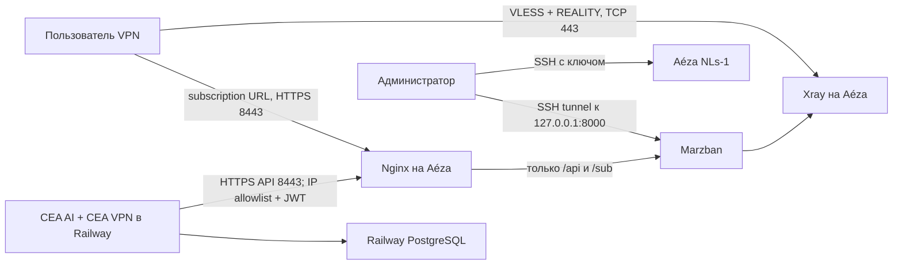

# CEA VPN: runbook первого сервера

Статус документа: подготовлен 15 июля 2026 года. Это инструкция для отдельного
окна изменений; её команды **не выполнялись** при создании файла.

## 1. Назначение и границы

Первый VPN-узел размещается на Aéza `NLs-1` в Амстердаме:

- 1 shared vCPU;
- 2 ГБ RAM;
- 30 ГБ NVMe;
- 1 публичный IPv4;
- канал 1 Гбит/с;
- обычный Shared-тариф, не Promo.

На VPS работают только Marzban, Xray и локальный Nginx. Оба Telegram-бота и
PostgreSQL остаются в существующем Railway-сервисе. Не переносить агрегатор на
VPS и не запускать второй экземпляр бота.

На момент написания `ceai/vpn_bot/handlers.py` является визуальным прототипом:
оплата и выдача VPN не реализованы. В репозитории уже подготовлены отдельные
VPN-таблицы и базовый клиент Marzban, но они ещё не подключены к обработчикам и
`ceai/config.py`. Добавление переменных в Railway само по себе ничего не
подключит. До отдельного изменения кода сохранять
`VPN_PROVISIONING_ENABLED=0` и не принимать реальные VPN-платежи.

Официальные источники:

- [тарифы Aéza](https://aeza.net/ru/virtual-servers);
- [установка Marzban](https://gozargah.github.io/marzban/en/docs/installation);
- [переменные Marzban](https://gozargah.github.io/marzban/en/docs/configuration);
- [Marzban REST API](https://gozargah.github.io/marzban/en/docs/api);
- [VLESS/REALITY в Marzban](https://gozargah.github.io/marzban/en/docs/core-settings);
- [актуальная спецификация REALITY](https://xtls.github.io/en/config/transports/reality.html);
- [резервное копирование Marzban](https://github.com/Gozargah/Marzban#backup);
- [статический исходящий IP Railway](https://docs.railway.com/networking/static-outbound-ips);
- [sealed variables Railway](https://docs.railway.com/variables#sealed-variables).

## 2. Целевая схема



Публичные порты VPS:

| Порт | Назначение | Доступ |
|---|---|---|
| `22/tcp` | SSH | только административный IP; временно `ufw limit`, если IP динамический |
| `80/tcp` | ACME HTTP-01 | публичный, только `/.well-known/acme-challenge/` |
| `443/tcp` | VLESS + REALITY | публичный |
| `8443/tcp` | API и subscription URL через Nginx | `/api/` только с Railway IP; `/sub/` публичен по секретному токену |
| `8000/tcp` | Marzban | только `127.0.0.1`, никогда не открывать в firewall |
| `9443/tcp` | локальная cover-страница REALITY | только `127.0.0.1` |

## 3. Стоп-условия до покупки и установки

Не начинать ввод в эксплуатацию, пока не выполнено всё ниже:

1. Поддержка Aéza письменно подтвердила, что на `NLs-1` допустимо оказывать
   платный VPN конечным пользователям при соблюдении AUP и обработке abuse.
2. Изучены действующие требования законодательства для коммерческого VPN,
   политика конфиденциальности, оферта и порядок ответа на abuse-жалобы.
3. Есть отдельная учётная запись Aéza с 2FA, а не общий пароль команды.
4. Есть SSH-ключ администратора Ed25519; приватный ключ не отправлялся в чат.
5. Есть домен и четыре DNS-only A-записи на IPv4 VPS:
   `vpn1.example.com`, `panel-vpn1.example.com`, `sub-vpn1.example.com`,
   `cover-vpn1.example.com`. Заменить `example.com` во всём runbook.
6. Для Railway включён Static Outbound IP на Pro-плане либо заранее выбран
   защищённый туннель/mTLS. Без этого API Marzban не открывать в интернет.
7. Назначен внешний зашифрованный backup storage, не находящийся на этом VPS.
8. Токен `@ceavpn_bot`, если он когда-либо попадал в чат, лог или документ,
   отозван в BotFather и заменён в Railway.

## 4. Создание VPS

В панели Aéza выбрать:

- локацию Amsterdam;
- тариф `NLs-1`, не Promo;
- Debian 12 x86_64;
- вход по SSH-ключу;
- hostname `cea-vpn-nl1`;
- резервные копии и автопродление выключены на первом месяце; уведомление о
  низком балансе включить в аккаунте.

Сразу записать в менеджер секретов: ID сервера, IPv4, дату оплаты, тариф и
контакт владельца. Не хранить root-пароль в репозитории.

## 5. Базовая защита Debian

Все команды ниже выполняются вручную после подстановки значений. Сначала
проверить доступ к web/VNC-консоли Aéza — это путь восстановления при ошибке SSH.

```bash
export ADMIN_IP_CIDR="203.0.113.10/32"
sudo apt-get update
sudo apt-get dist-upgrade -y
sudo apt-get install -y ca-certificates curl jq nginx certbot ufw fail2ban unattended-upgrades needrestart
sudo timedatectl set-timezone UTC
sudo timedatectl set-ntp true
timedatectl status
```

Создать отдельного оператора. Перед отключением root обязательно открыть вторую
SSH-сессию и проверить `sudo -v`.

```bash
sudo adduser --disabled-password --gecos "" ceaops
sudo usermod -aG sudo ceaops
sudo install -d -m 0700 -o ceaops -g ceaops /home/ceaops/.ssh
sudo cp /root/.ssh/authorized_keys /home/ceaops/.ssh/authorized_keys
sudo chown ceaops:ceaops /home/ceaops/.ssh/authorized_keys
sudo chmod 0600 /home/ceaops/.ssh/authorized_keys
```

Создать `/etc/ssh/sshd_config.d/10-cea-hardening.conf`:

```text
PermitRootLogin no
PasswordAuthentication no
KbdInteractiveAuthentication no
PubkeyAuthentication yes
AuthenticationMethods publickey
AllowUsers ceaops
X11Forwarding no
AllowAgentForwarding no
AllowTcpForwarding local
PermitTunnel no
MaxAuthTries 3
LoginGraceTime 30
ClientAliveInterval 300
ClientAliveCountMax 2
```

Проверка и безопасное применение:

```bash
sudo sshd -t
sudo systemctl reload ssh
ssh ceaops@VPS_IPV4
sudo -v
```

Firewall сначала разрешает SSH, затем включается. Не закрывать текущую сессию,
пока новый вход не проверен.

```bash
sudo ufw default deny incoming
sudo ufw default allow outgoing
sudo ufw allow from "$ADMIN_IP_CIDR" to any port 22 proto tcp
sudo ufw allow 80/tcp
sudo ufw allow 443/tcp
sudo ufw allow 8443/tcp
sudo ufw deny out 25/tcp
sudo ufw enable
sudo ufw status verbose
sudo systemctl enable --now fail2ban
sudo fail2ban-client status sshd
```

Если административный IP динамический, временно использовать
`sudo ufw limit 22/tcp`, но заменить это на allowlist или административный VPN.
UFW должен работать с IPv6 (`IPV6=yes`), даже если AAAA-запись пока не создана.

Ограничить рост Docker-логов до установки Marzban. Создать
`/etc/docker/daemon.json` после появления Docker, не перезаписывая существующие
настройки:

```json
{
  "log-driver": "json-file",
  "log-opts": {"max-size": "10m", "max-file": "3"}
}
```

## 6. TLS и локальный Nginx

Сначала создать только HTTP-конфигурацию для ACME и получить сертификат.

```bash
sudo install -d -m 0755 /var/www/letsencrypt
```

`/etc/nginx/sites-available/cea-vpn` на первом этапе:

```nginx
server {
    listen 80;
    listen [::]:80;
    server_name panel-vpn1.example.com sub-vpn1.example.com cover-vpn1.example.com;

    location ^~ /.well-known/acme-challenge/ {
        root /var/www/letsencrypt;
    }
    location / { return 404; }
}
```

```bash
sudo ln -s /etc/nginx/sites-available/cea-vpn /etc/nginx/sites-enabled/cea-vpn
sudo rm -f /etc/nginx/sites-enabled/default
sudo nginx -t
sudo systemctl reload nginx
sudo certbot certonly --webroot -w /var/www/letsencrypt \
  -d panel-vpn1.example.com -d sub-vpn1.example.com -d cover-vpn1.example.com
sudo certbot renew --dry-run
```

После получения сертификата добавить в `http {}` файла `/etc/nginx/nginx.conf`:

```nginx
limit_req_zone $binary_remote_addr zone=marzban_api:10m rate=10r/s;
limit_req_zone $binary_remote_addr zone=marzban_sub:10m rate=3r/s;
```

Затем заменить конфигурацию сайта на шаблон ниже. Обязательно заменить домены и
`RAILWAY_STATIC_OUTBOUND_IP`; с плейсхолдером `nginx -t` должен считаться
непройденным.

```nginx
server {
    listen 80;
    listen [::]:80;
    server_name panel-vpn1.example.com sub-vpn1.example.com cover-vpn1.example.com;
    location ^~ /.well-known/acme-challenge/ { root /var/www/letsencrypt; }
    location / { return 404; }
}

server {
    listen 8443 ssl;
    server_name panel-vpn1.example.com;
    ssl_certificate /etc/letsencrypt/live/panel-vpn1.example.com/fullchain.pem;
    ssl_certificate_key /etc/letsencrypt/live/panel-vpn1.example.com/privkey.pem;
    ssl_protocols TLSv1.2 TLSv1.3;
    server_tokens off;

    location ^~ /api/ {
        allow RAILWAY_STATIC_OUTBOUND_IP;
        deny all;
        limit_req zone=marzban_api burst=30 nodelay;
        proxy_pass http://127.0.0.1:8000;
        proxy_set_header Host $host;
        proxy_set_header X-Real-IP $remote_addr;
        proxy_set_header X-Forwarded-For $proxy_add_x_forwarded_for;
        proxy_set_header X-Forwarded-Proto https;
        proxy_connect_timeout 5s;
        proxy_read_timeout 15s;
    }
    location / { return 404; }
}

server {
    listen 8443 ssl;
    server_name sub-vpn1.example.com;
    ssl_certificate /etc/letsencrypt/live/panel-vpn1.example.com/fullchain.pem;
    ssl_certificate_key /etc/letsencrypt/live/panel-vpn1.example.com/privkey.pem;
    ssl_protocols TLSv1.2 TLSv1.3;
    server_tokens off;

    location ^~ /sub/ {
        access_log off;
        limit_req zone=marzban_sub burst=10 nodelay;
        proxy_pass http://127.0.0.1:8000;
        proxy_set_header Host $host;
        proxy_set_header X-Forwarded-Proto https;
        proxy_connect_timeout 5s;
        proxy_read_timeout 15s;
    }
    location / { return 404; }
}

server {
    listen 127.0.0.1:9443 ssl;
    server_name cover-vpn1.example.com;
    ssl_certificate /etc/letsencrypt/live/panel-vpn1.example.com/fullchain.pem;
    ssl_certificate_key /etc/letsencrypt/live/panel-vpn1.example.com/privkey.pem;
    ssl_protocols TLSv1.2 TLSv1.3;
    access_log off;
    default_type text/plain;
    return 200 "ok\n";
}
```

Railway предупреждает, что статический IP может быть общим с другими клиентами,
поэтому allowlist дополняет JWT-аутентификацию, а не заменяет её. Если Static
Outbound IP недоступен, не использовать `allow 0.0.0.0/0`: оставить API закрытым
до настройки mTLS, Cloudflare Access service token или другого защищённого
туннеля. Subscription URL остаётся публичным, поскольку его длинный токен является
секретом; поэтому URI не должен попадать в access log.

```bash
sudo nginx -t
sudo systemctl reload nginx
```

## 7. Проверяемая установка Marzban

Не выполнять `curl | bash` напрямую и не использовать `latest`. Во время окна
изменений выбрать стабильный релиз Marzban и полный commit SHA официального
installer-репозитория, сохранить их в change log и проверить release notes.

```bash
export MARZBAN_VERSION="vX.Y.Z"
export INSTALLER_COMMIT="FULL_40_CHARACTER_REVIEWED_COMMIT_SHA"
curl -fL "https://raw.githubusercontent.com/Gozargah/Marzban-scripts/${INSTALLER_COMMIT}/marzban.sh" \
  -o /tmp/marzban-install.sh
sha256sum /tmp/marzban-install.sh
less /tmp/marzban-install.sh
sudo bash /tmp/marzban-install.sh install --version "$MARZBAN_VERSION"
```

Для первого узла использовать SQLite: это официальный default и экономит RAM.
При нескольких узлах или необходимости HA отдельно планировать миграцию на
внешнюю БД. После установки зафиксировать Docker image digest в
`/opt/marzban/docker-compose.yml` вместо плавающего тега и сохранить digest в
change log.

В `/opt/marzban/.env` должны быть как минимум:

```env
UVICORN_HOST="127.0.0.1"
UVICORN_PORT=8000
XRAY_JSON="/var/lib/marzban/xray_config.json"
SQLALCHEMY_DATABASE_URL="sqlite:////var/lib/marzban/db.sqlite3"
XRAY_SUBSCRIPTION_URL_PREFIX="https://sub-vpn1.example.com:8443"
XRAY_SUBSCRIPTION_PATH="sub"
DOCS=False
DEBUG=False
JWT_ACCESS_TOKEN_EXPIRE_MINUTES=60
```

```bash
sudo chown root:root /opt/marzban/.env /opt/marzban/docker-compose.yml
sudo chmod 0600 /opt/marzban/.env
sudo chmod 0644 /opt/marzban/docker-compose.yml
sudo marzban restart
sudo marzban status
sudo ss -lntp
```

`127.0.0.1:8000` должен слушаться локально; `0.0.0.0:8000` — стоп-условие.

Создать три разные учётные записи. Человеческий sudo-admin используется
только через SSH tunnel; worker получает отдельного non-sudo admin,
который владеет только пользователями бота; отдельный sudo-admin нужен
только root-скрипту Host Settings, так как Marzban v0.8.4 не имеет
более узкой роли для `/api/hosts`.

```bash
sudo marzban cli admin create -u cea-human-admin --sudo
sudo marzban cli admin create -u cea-railway-bot --no-sudo
```

Перед созданием технического sudo-admin убедиться, что запущен
зафиксированный в `deploy/vpn/docker-compose.yml` image Marzban v0.8.4,
а не `latest`. Команда `admin create` ниже — точный контракт CLI v0.8.4:
пароль передаётся через `MARZBAN_ADMIN_PASSWORD`, а `-tg 0 -dc 0`
отключают интерактивные запросы Telegram ID и Discord webhook. Случайный
пароль не выводится в терминал и тот же value атомарно попадает
в отдельный credentials-файл:

```bash
sudo -i
set -euo pipefail
umask 077
expected_image='ghcr.io/gozargah/marzban@sha256:8e422c21997e5d2e3fa231eeff73c0a19193c20fc02fa4958e9368abb9623b8d'
actual_image="$(docker inspect --format '{{.Config.Image}}' ceavpn-marzban)"
[[ "$actual_image" == "$expected_image" ]]
[[ ! -e /root/ceavpn-sudo-admin.env ]]
MARZBAN_SUDO_PASSWORD="$(openssl rand -base64 48 | tr -d '\n')"
export MARZBAN_ADMIN_PASSWORD="$MARZBAN_SUDO_PASSWORD"
marzban cli admin create -u cea-hosts-admin --sudo -tg 0 -dc 0
unset MARZBAN_ADMIN_PASSWORD
credentials_tmp="$(mktemp /root/ceavpn-sudo-admin.env.new.XXXXXX)"
trap 'rm -f -- "$credentials_tmp"' EXIT
printf 'MARZBAN_SUDO_USERNAME=%q\nMARZBAN_SUDO_PASSWORD=%q\n' \
  'cea-hosts-admin' "$MARZBAN_SUDO_PASSWORD" \
  > "$credentials_tmp"
chmod 0600 "$credentials_tmp"
mv "$credentials_tmp" /root/ceavpn-sudo-admin.env
trap - EXIT
unset MARZBAN_SUDO_PASSWORD expected_image actual_image credentials_tmp
exit
```

`/root/ceavpn-sudo-admin.env` не должен попадать в
`/root/ceavpn-admin.env`, `/etc/ceavpn/worker.env`, Railway, backup логов
или shell history. Worker всегда остаётся на `cea-railway-bot --no-sudo`.

Не задавать `SUDO_USERNAME`/`SUDO_PASSWORD` в `.env`: официальная документация
рекомендует CLI. Для панели:

```bash
ssh -L 8000:127.0.0.1:8000 ceaops@VPS_IPV4
```

Затем открыть `http://127.0.0.1:8000/dashboard/`.

## 8. VLESS + REALITY

Перед изменением сохранить исходный Xray config. Ключи генерировать на VPS;
приватный REALITY key никогда не переносить в Railway.

```bash
sudo cp -a /var/lib/marzban/xray_config.json \
  "/var/lib/marzban/xray_config.json.before-reality.$(date -u +%Y%m%dT%H%M%SZ)"
sudo bash -c '
set -euo pipefail
umask 077
[[ ! -e /root/ceavpn-reality-keys.txt ]] || {
  echo "Reality key file already exists; refusing to rotate it" >&2
  exit 1
}
tmp="$(mktemp /root/ceavpn-reality-keys.txt.new.XXXXXX)"
trap '\''rm -f -- "$tmp"'\'' EXIT
docker compose -f /opt/marzban/docker-compose.yml exec -T marzban \
  xray x25519 >"$tmp"
grep -q "^Private key:[[:space:]]*[^[:space:]]" "$tmp"
grep -q "^Public key:[[:space:]]*[^[:space:]]" "$tmp"
chmod 0600 "$tmp"
mv "$tmp" /root/ceavpn-reality-keys.txt
trap - EXIT
'
```

Команда не выводит Reality private key в терминал и атомарно
создаёт `/root/ceavpn-reality-keys.txt` с mode `0600`. Не вставлять
содержимое этого файла в чат, shell history или issue tracker.

Основной inbound в проверенном шаблоне имеет точный tag
`VLESS TCP REALITY`:

- listen `0.0.0.0`, TCP port `443`;
- protocol `vless`, `decryption: none`;
- transport `raw` (в старых совместимых схемах поле называлось `tcp`);
- security `reality`;
- flow пользователей `xtls-rprx-vision`;
- `target: 127.0.0.1:9443`;
- `serverNames: ["cover-vpn1.example.com"]`;
- новый `privateKey` и случайный 16-hex `shortId`;
- `show: false`, разумный `maxTimeDiff`, например `60000` мс.

Использование локального TLS target не превращает сервер в открытый forwarder на
чужой CDN. Если вместо него выбирается внешний target, следовать актуальной
документации REALITY: target и SNI должны совпадать, а CDN/чужой ASN без анализа
использовать нельзя.

В routing заблокировать как минимум `geoip:private`, localhost/metadata-сети и
BitTorrent согласно AUP. Не включать подробный access log с адресами посещений;
оставить error log уровня `warning` с ротацией. Marzban должен хранить только
необходимые для биллинга объёмы трафика и срок действия.

Перед рестартом проверить конфигурацию версией Xray внутри контейнера:

```bash
cd /opt/marzban
sudo docker compose exec marzban xray run -test -c /var/lib/marzban/xray_config.json
sudo marzban restart
sudo ss -lntp | grep ':443 '
sudo marzban logs
```

В Host Settings указать address `vpn1.example.com`, port `443`, SNI
`cover-vpn1.example.com`, fingerprint `chrome` и правильный Reality public key.
Не публиковать AAAA до отдельного IPv6-теста.

### 8.1. TLS WebSocket fallback на существующем `8443`

Резервный transport не требует нового публичного порта. В Xray используется
inbound с точным tag `VLESS WS TLS FALLBACK`, который слушает только
`127.0.0.1:10001`. Активный Nginx listener подписок на `8443` проксирует только
один exact секретный path на этот loopback. Не открывать `10001` в UFW/Aéza и
не создавать отдельный listener `2053`.
В Xray этот inbound стоит первым: Marzban v0.8.4 сортирует URI по
порядку Xray config, поэтому Happ первым импортирует рабочий TLS/WS URI.

`deploy/vpn/apply-reality-config.sh` совместно рендерит Xray и Nginx templates.
При первом запуске он атомарно создаёт root-only
`/root/ceavpn-fallback.env`, затем проверяет JSON, запускает `xray run -test`,
проверяет candidate и активную конфигурацию через `nginx -t`, сохраняет backup
обоих файлов и только после этого перезапускает Marzban и reload Nginx. Default
активного Nginx-файла для первого узла — `/etc/nginx/sites-enabled/ceavpn`.
Секретный path не выводится.

Перед отдельным окном изменений скопировать именно проверенные файлы из этого
репозитория, не скачивая шаблоны со стороннего URL:

```bash
install -o root -g root -m 0644 deploy/vpn/xray_config.json \
  /opt/marzban/xray_config.template.json
install -o root -g root -m 0644 deploy/vpn/nginx.conf \
  /opt/marzban/nginx.template.conf
install -o root -g root -m 0755 deploy/vpn/apply-reality-config.sh \
  /opt/ceavpn/apply-reality-config.sh
install -o root -g root -m 0755 deploy/vpn/configure-marzban-hosts.sh \
  /opt/ceavpn/configure-marzban-hosts.sh
/opt/ceavpn/apply-reality-config.sh
```

После успешного применения выполнить от root:

```bash
/opt/ceavpn/configure-marzban-hosts.sh
```

Скрипт использует только sudo-admin credentials из
`/root/ceavpn-sudo-admin.env`; worker этот файл не читает. Скрипт читает
текущее состояние `GET /api/hosts` и одним partial `PUT /api/hosts` обновляет
только два tag:

| Inbound tag | Address | Public port | SNI / Host | Security |
|---|---|---:|---|---|
| `VLESS WS TLS FALLBACK` | `sub.79-137-197-51.sslip.io` | `8443` | `sub.79-137-197-51.sslip.io` | TLS, `http/1.1` |
| `VLESS TCP REALITY` | `79.137.197.51` | `443` | `cover.79-137-197-51.sslip.io` | inbound default / REALITY |

Fallback path берётся из root-only env и не должен попадать в команды, вывод
API или логи. Скрипт проверяет, что Host Settings всех остальных inbound tag
сохранились, а при ошибке пытается вернуть исходные настройки двух управляемых
tag. Provisioning worker должен назначать пользователю оба точных tag; иначе
в subscription не появится второй URI.

Создать одноразового smoke-user с лимитом 100 МБ и сроком 24 часа. Проверить
подключение с домашней сети и мобильного интернета, DNS/IP leak, остановку после
лимита и удаление тестового пользователя. Plain Marzban не гарантирует лимит
«до 3 устройств» — это нельзя рекламировать как технически enforced до отдельной
реализации device/session control.

## 9. Railway: существующие и будущие переменные

Уже поддерживаются текущим кодом:

```env
VPN_TELEGRAM_BOT_TOKEN=<sealed secret>
VPN_BOT_USERNAME=ceavpn_bot
VPN_TELEGRAM_WEBHOOK_PATH=/telegram/vpn/webhook
VPN_TELEGRAM_WEBHOOK_SECRET=<sealed random secret>
VPN_SUPPORT_USERNAME=cea_help
VPN_CHANNEL_URL=https://t.me/ceafamily
```

Предлагаемый контракт будущей интеграции; эти переменные потребуют изменений в
`ceai/config.py`, сервисе provisioning, миграциях и тестах:

```env
VPN_PROVISIONING_ENABLED=0
VPN_BACKEND=marzban
VPN_SERVER_CODE=ams-1
VPN_MARZBAN_BASE_URL=https://panel-vpn1.example.com:8443
VPN_MARZBAN_ADMIN_USERNAME=cea-railway-bot
VPN_MARZBAN_ADMIN_PASSWORD=<sealed secret>
VPN_MARZBAN_REQUEST_TIMEOUT_SECONDS=10
VPN_MARZBAN_INBOUND_TAG=VLESS_REALITY_443
VPN_SUBSCRIPTION_BASE_URL=https://sub-vpn1.example.com:8443
```

Пароли и токены пометить Sealed. Не добавлять их в `.env.example`, git, Docker
image, логи или сообщения Telegram. Код должен повторно получать короткий JWT при
старте/401, проверять TLS, иметь timeout и не логировать credentials или
subscription URL.

До `VPN_PROVISIONING_ENABLED=1` должны появиться:

1. отдельные таблицы VPN orders/subscriptions/servers/provisioning events;
2. идемпотентный ключ заказа и защита от двойной выдачи webhook-ретраями;
3. opaque Marzban username без Telegram ID/телефона;
4. create, extend, disable, re-enable и revoke flows;
5. retry queue и ручное восстановление после частичного сбоя;
6. тестовый платёж end-to-end и тест истечения подписки;
7. kill switch, который запрещает новые выдачи, не ломая действующих клиентов.

## 10. Резервное копирование

Бэкап содержит БД, admin credentials, subscription tokens и REALITY private key;
это высокочувствительный секрет.

Перед любым обновлением и ежедневно:

```bash
sudo marzban backup
sudo ls -lh /opt/marzban/backup
sudo sha256sum /opt/marzban/backup/backup_*.tar.gz
```

Последний архив немедленно отправлять в отдельное **зашифрованное** хранилище.
Не считать локальный архив или snapshot Aéza единственным бэкапом. Рекомендуемая
retention: 7 daily, 4 weekly, 3 monthly. Ограничить файлы правами `0600` и
автоматически удалять локальные архивы старше семи дней после подтверждённой
off-site копии.

Раз в месяц выполнять restore drill на отдельном временном VPS без публичного
443: проверить checksum, распаковать в пустой каталог, восстановить SQLite и
конфигурацию, запустить той же pinned-версией и затем уничтожить тестовый VPS.
Бэкап без успешного restore drill не считается проверенным.

## 11. Health checks и эксплуатация

После каждого изменения:

```bash
sudo systemctl is-active ssh docker nginx fail2ban
sudo marzban status
curl -fsS http://127.0.0.1:8000/dashboard/ -o /dev/null
curl -fsS https://sub-vpn1.example.com:8443/ -o /dev/null || true
sudo ss -lntp
sudo ufw status verbose
df -h / /var/lib/marzban
free -m
sudo docker stats --no-stream
timedatectl show -p NTPSynchronized --value
sudo certbot renew --dry-run
```

Ожидаемые listeners: SSH, Nginx `80/8443`, Xray `443`, Marzban только
`127.0.0.1:8000`, cover только `127.0.0.1:9443`. Проверить с внешней машины, что
`8000` и `9443` закрыты.

Мониторинг должен уведомлять о:

- недоступности 443 и subscription endpoint;
- остановке контейнера или Xray;
- заполнении диска более 75%/90%;
- RAM/swap pressure и OOM;
- сертификате с остатком менее 14 дней;
- росте ошибок API, provisioning queue и pending orders;
- резком росте трафика и abuse-жалобах;
- неуспешном или устаревшем более 26 часов off-site backup.

Не публиковать `/docs`, `/redoc`, `/openapi.json` и dashboard. Для диагностики API
получать JWT через `POST /api/admin/token`, затем проверять `GET /api/system`; не
сохранять пароль или bearer token в shell history.

## 12. Обновление и откат

Не запускать `marzban update` вслепую: команда подтягивает latest. Для каждого
обновления назначить окно, прочитать release notes, сделать и выгрузить backup,
записать текущие Marzban/Xray версии, Docker digest и checksum конфигов.

Порядок изменения:

1. `VPN_PROVISIONING_ENABLED=0` и deploy Railway.
2. Дождаться завершения provisioning queue.
3. Сделать off-site backup и проверить checksum.
4. Скопировать `/opt/marzban/.env`, `docker-compose.yml` и
   `/var/lib/marzban/xray_config.json` в root-only change directory.
5. Обновить на конкретную версию/digest, не `latest`.
6. Валидировать Xray config, перезапустить и выполнить health/smoke checks.
7. Включить provisioning только после успешного тестового заказа.

Быстрый rollback конфигурации:

```bash
sudo cp -a /var/lib/marzban/xray_config.json.before-reality.TIMESTAMP \
  /var/lib/marzban/xray_config.json
cd /opt/marzban
sudo docker compose exec marzban xray run -test -c /var/lib/marzban/xray_config.json
sudo marzban restart
```

Rollback версии без изменения схемы БД: вернуть прежний image digest в Compose,
выполнить `docker compose config`, `docker compose up -d` и полный smoke test.

Если миграция БД несовместима, не пытаться чинить production вручную:

1. оставить provisioning выключенным;
2. `marzban down`;
3. переименовать текущий `/var/lib/marzban`, не удалять его;
4. проверить `tar -tzf` и checksum последнего pre-change архива;
5. восстановить `.env`, Compose, `marzban_data` и `db_backup.sqlite` в ожидаемые
   пути с root-only permissions;
6. вернуть прежний pinned image digest;
7. запустить, проверить одного тестового и одного существующего пользователя;
8. задокументировать потерянное окно данных и вручную сверить оплаченные заказы.

При критическом инциденте fail closed: выключить новые выдачи в Railway и
остановить/disable проблемный inbound, но не удалять пользователей, БД или VPS до
снятия forensic-копии.

## 13. Итоговый go-live checklist

- [ ] Письменное разрешение Aéza и юридическая проверка получены.
- [ ] 2FA, SSH key-only, non-root operator, firewall и fail2ban проверены.
- [ ] `8000/9443` недоступны извне; `/api/` ограничен Railway IP и JWT.
- [ ] Marzban и Docker image зафиксированы конкретной версией/digest.
- [ ] REALITY key/shortId уникальны, config проходит `xray run -test`.
- [ ] Домены, сертификаты и `certbot renew --dry-run` работают.
- [ ] Off-site encrypted backup и restore drill успешны.
- [ ] В коде реализованы VPN-таблицы, idempotency, retries и kill switch.
- [ ] Trial, оплата, продление, истечение и revoke протестированы end-to-end.
- [ ] Агрегатор и VPN-бот одновременно проходят `/healthz` на Railway.
- [ ] Есть мониторинг, abuse-контакт и дежурный с доступом к rollback.
- [ ] Только после этого `VPN_PROVISIONING_ENABLED=1`.
