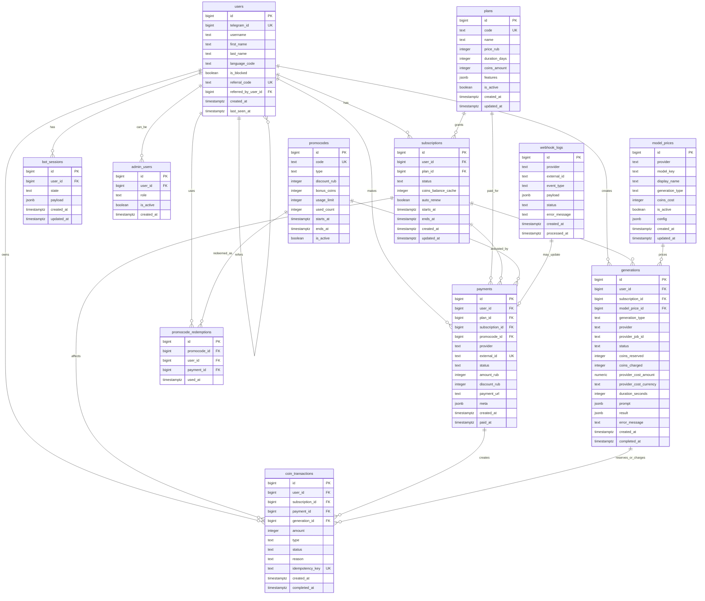

# CeaAI: этап 2 — модель данных

Этот документ описывает логику базы данных CeaAI: какие сущности нужны, как они связаны, какие поля должны быть в таблицах и какие правила нельзя нарушать при оплатах, подписках и генерациях.

Главная задача модели данных — сделать так, чтобы:

- пользователь мог покупать подписку;
- подписка давала коины;
- коины списывались безопасно;
- платежи не начислялись дважды;
- генерации можно было отслеживать;
- цены моделей можно было менять без правки кода;
- позже можно было добавить промокоды, рефералку, админку, Mini App и новые AI-провайдеры.

## 1. Общая идея модели

В CeaAI нельзя смешивать деньги, подписки, коины и генерации в одну сущность. У каждой части своя зона ответственности:

```text
users             — кто пользуется ботом
plans             — какие тарифы продаем
subscriptions     — какой доступ есть у пользователя
payments          — реальные платежи через платежную систему
webhook_logs      — защита от повторных webhook
coin_transactions — все движения коинов
model_prices      — сколько стоит каждая AI-модель
generations       — история и состояние AI-задач
promocodes        — промокоды
bot_sessions      — состояние диалога в Telegram-боте
admin_users       — администраторы
```

Важный принцип:

```text
payments отвечают за деньги
subscriptions отвечают за доступ
coin_transactions отвечают за баланс
generations отвечают за AI-задачи
webhook_logs защищают от дублей
bot_sessions отвечают за диалоги в боте
```

## 2. ERD-схема



## 3. Таблица users

`users` хранит Telegram-пользователей.

Минимально нужны:

- `id` — внутренний id пользователя;
- `telegram_id` — id пользователя в Telegram, должен быть уникальным;
- `username`;
- `first_name`;
- `last_name`;
- `language_code` — нужен для локализации;
- `is_blocked` — бан пользователя без удаления из базы;
- `referral_code` — персональный реферальный код пользователя;
- `referred_by_user_id` — кто пригласил пользователя;
- `created_at`;
- `last_seen_at`.

Почему важны `referral_code` и `referred_by_user_id`:

Если реферальную программу добавить позже, придется мигрировать пользователей и генерировать коды задним числом. Лучше заложить это сразу.

## 4. Таблица plans

`plans` — справочник тарифов.

Примеры:

```text
Старт   — 299 руб. / 100 coins / 30 дней
Базовый — 699 руб. / 300 coins / 30 дней
Про     — 1490 руб. / 800 coins / 30 дней
```

Поля:

- `id`;
- `code` — технический код тарифа, например `start`, `basic`, `pro`;
- `name` — публичное название тарифа;
- `price_rub` — цена в рублях;
- `duration_days` — срок действия;
- `coins_amount` — сколько коинов начисляется;
- `features` — jsonb с описанием возможностей тарифа;
- `is_active` — можно ли покупать тариф;
- `created_at`;
- `updated_at`.

Главное правило:

```text
Цены тарифов меняются только в plans.
```

Не нужно хардкодить тарифы в боте.

## 5. Таблица subscriptions

`subscriptions` хранит подписки пользователей.

Поля:

- `id`;
- `user_id`;
- `plan_id`;
- `status` — `active`, `expired`, `cancelled`, `pending`;
- `coins_balance_cache` — быстрый кэш текущего баланса;
- `auto_renew` — будет ли подписка продлеваться автоматически;
- `starts_at`;
- `ends_at`;
- `created_at`;
- `updated_at`.

Важный момент по балансу:

```text
Источник истины по коинам — coin_transactions.
coins_balance_cache в subscriptions — только кэш для быстрого чтения.
```

Почему так:

Если хранить баланс только в `subscriptions.coins_balance`, будет сложно разбирать спорные ситуации: где коины начислились, где списались, где вернулись. Через `coin_transactions` видна вся история.

Правило активной подписки:

```text
У одного пользователя должна быть только одна active-подписка.
```

Это нужно обеспечить на уровне логики приложения или частичным уникальным индексом в базе.

## 6. Таблица payments

`payments` хранит каждый платеж через внешнюю платежную систему.

Поля:

- `id`;
- `user_id`;
- `plan_id`;
- `subscription_id` — подписка, которую активировал платеж;
- `promocode_id` — примененный промокод, если был;
- `provider` — `yookassa`, `cloudpayments`, `robokassa`, `tbank`;
- `external_id` — id платежа в платежной системе;
- `status` — `pending`, `paid`, `failed`, `cancelled`, `refunded`;
- `amount_rub`;
- `discount_rub`;
- `payment_url`;
- `meta` — полный ответ платежки в jsonb;
- `created_at`;
- `paid_at`.

Почему нужен `subscription_id`:

Если пользователь несколько раз покупал один и тот же тариф, одной связи `payment -> plan` недостаточно. Нужно понимать, какой платеж активировал какую подписку и на какой период.

Почему нужен `meta`:

Платежки могут присылать много технических данных. Их лучше сохранять целиком, чтобы потом разбираться в спорных ситуациях.

## 7. Таблица webhook_logs

`webhook_logs` — обязательная таблица для защиты от повторной обработки webhook.

Платежные системы могут прислать один и тот же webhook несколько раз. Без логов можно случайно начислить коины дважды.

Поля:

- `id`;
- `provider`;
- `external_id` — id события или платежа из платежки;
- `event_type` — тип события, например `payment.succeeded`;
- `payload` — полный webhook в jsonb;
- `status` — `received`, `processed`, `ignored`, `failed`;
- `error_message`;
- `created_at`;
- `processed_at`.

Обязательное правило:

```text
Перед обработкой webhook проверяем уникальность provider + external_id + event_type.
Если такой webhook уже обработан — игнорируем.
```

## 8. Таблица coin_transactions

`coin_transactions` — самая важная таблица для учета коинов.

Она хранит каждое движение:

- начисление после оплаты;
- списание после генерации;
- резерв на время генерации;
- возврат при ошибке;
- ручную корректировку админом;
- бонус по промокоду;
- бонус по рефералке.

Поля:

- `id`;
- `user_id`;
- `subscription_id`;
- `payment_id`;
- `generation_id`;
- `amount` — положительное число для начислений, отрицательное для списаний;
- `type` — `credit`, `reserve`, `debit`, `refund`, `manual_adjustment`, `promo_bonus`, `referral_bonus`;
- `status` — `pending`, `completed`, `cancelled`, `failed`;
- `reason`;
- `idempotency_key` — уникальный ключ операции;
- `created_at`;
- `completed_at`.

Примеры `idempotency_key`:

```text
payment:yookassa:2e8d4:credit
generation:981:reserve
generation:981:charge
generation:981:refund
promo:START100:user:42
```

Зачем нужен `idempotency_key`:

Если backend повторно обработает платеж, webhook или генерацию, уникальный ключ не даст создать второе начисление или списание.

## 9. Таблица model_prices

`model_prices` — справочник AI-моделей и их стоимости в коинах.

Поля:

- `id`;
- `provider` — `openai`, `anthropic`, `deepseek`, `xai`, `runway`, `elevenlabs` и т.д.;
- `model_key` — техническое имя модели у провайдера;
- `display_name` — красивое название для пользователя;
- `generation_type` — `text`, `image`, `video`, `music`, `tts`, `seo`;
- `coins_cost` — стоимость действия в коинах;
- `is_active`;
- `config` — jsonb с настройками модели;
- `created_at`;
- `updated_at`.

Главное правило:

```text
Цены на AI-модели меняются только в model_prices.
```

Бот не должен знать, сколько стоит ChatGPT или генерация картинки. Он должен получать эту цену из backend.

## 10. Таблица generations

`generations` — центральная таблица для всех AI-задач.

Поля:

- `id`;
- `user_id`;
- `subscription_id`;
- `model_price_id`;
- `generation_type` — `text`, `image`, `video`, `music`, `tts`, `seo`;
- `provider`;
- `provider_job_id` — id задачи у внешнего AI-провайдера;
- `status` — `pending`, `processing`, `completed`, `failed`, `cancelled`;
- `coins_reserved` — сколько коинов было зарезервировано;
- `coins_charged` — сколько коинов списали по факту;
- `provider_cost_amount` — реальная себестоимость запроса;
- `provider_cost_currency` — валюта себестоимости, например `USD`;
- `duration_seconds` — длительность для видео, музыки или озвучки;
- `prompt` — входные данные в jsonb;
- `result` — результат в jsonb;
- `error_message`;
- `created_at`;
- `completed_at`.

Почему `prompt` и `result` в jsonb:

У разных типов генерации разные структуры. Текст, картинка, видео, музыка и SEO-задача не должны насильно помещаться в одинаковые текстовые поля.

Почему нужен `generation_type`:

Не надо каждый раз делать join с `model_prices`, чтобы понять, что это была за генерация.

Почему нужен `provider_job_id`:

Для видео, музыки и тяжелых задач провайдер часто не отдает результат сразу, а возвращает id задачи. По этому id backend будет проверять статус.

Почему нужны `provider_cost_amount` и `provider_cost_currency`:

Без реальной себестоимости нельзя считать маржу. Нужно понимать, сколько пользователь заплатил коинами и сколько этот запрос стоил CeaAI в API.

## 11. Таблицы promocodes и promocode_redemptions

`promocodes` хранит промокоды.

Поля:

- `id`;
- `code`;
- `type` — `discount`, `bonus_coins`, `free_trial`;
- `discount_rub`;
- `bonus_coins`;
- `usage_limit`;
- `used_count`;
- `starts_at`;
- `ends_at`;
- `is_active`.

`promocode_redemptions` хранит факты использования промокодов.

Поля:

- `id`;
- `promocode_id`;
- `user_id`;
- `payment_id`;
- `used_at`.

Зачем нужна отдельная таблица:

Одного `promocodes.used_count` недостаточно. Нужно знать, какой пользователь уже применял конкретный промокод.

Обязательное правило:

```text
Один пользователь не может использовать один и тот же промокод дважды.
```

Это можно обеспечить уникальным индексом:

```text
unique(promocode_id, user_id)
```

## 12. Таблица bot_sessions

`bot_sessions` хранит состояние диалога в Telegram-боте.

Пример:

```text
Пользователь нажал "Генерация изображения"
Бот попросил отправить промпт
Пользователь отправил текст
Backend должен понять, что это промпт для картинки
```

Поля:

- `id`;
- `user_id`;
- `state` — текущее состояние диалога;
- `payload` — временные данные в jsonb;
- `created_at`;
- `updated_at`.

Примеры `state`:

```text
idle
waiting_text_prompt
waiting_image_prompt
waiting_video_prompt
waiting_payment_choice
waiting_promocode
```

Для MVP это можно хранить в базе. Позже можно перенести в Redis, если будет высокая нагрузка.

## 13. Таблица admin_users

`admin_users` хранит администраторов.

Поля:

- `id`;
- `user_id`;
- `role` — `owner`, `admin`, `support`;
- `is_active`;
- `created_at`.

Зачем нужна:

Нужно управлять ботом без прямых запросов в базу:

- смотреть пользователя;
- менять баланс вручную;
- выдавать бонусы;
- отключать модели;
- смотреть платежи;
- смотреть ошибки генераций.

Для очень раннего MVP можно сделать проще и хранить `is_admin` в `users`, но отдельная таблица гибче.

## 14. Порядок операций при оплате

Правильный порядок:

```text
1. Пользователь выбирает тариф.
2. Backend создает payment со статусом pending.
3. Backend получает payment_url от платежной системы.
4. Бот отправляет пользователю кнопку оплаты.
5. Пользователь оплачивает.
6. Платежка отправляет webhook.
7. Backend записывает webhook в webhook_logs.
8. Backend проверяет, не был ли webhook обработан раньше.
9. Backend проверяет подпись webhook.
10. Backend переводит payment в paid.
11. Backend создает или продлевает subscription.
12. Backend начисляет coins через coin_transactions.
13. Backend обновляет coins_balance_cache.
14. Бот сообщает пользователю об успешной оплате.
```

Критическое правило:

```text
Коины начисляются только после подтвержденного webhook от платежной системы.
```

Нельзя начислять коины просто потому, что пользователь вернулся на страницу успешной оплаты.

## 15. Порядок операций при генерации

Правильный порядок:

```text
1. Создать запись в generations со статусом pending.
2. Проверить активную подписку.
3. Проверить баланс коинов.
4. Зарезервировать коины через coin_transactions.
5. Обновить generations.status на processing.
6. Отправить запрос в AI API.
7. Получить результат или provider_job_id.
8. Если результат готов — сохранить result.
9. Списать зарезервированные коины окончательно.
10. Обновить generations.status на completed.
11. Обновить coins_balance_cache.
12. Отправить результат пользователю.
```

Если генерация упала:

```text
1. Обновить generations.status на failed.
2. Записать error_message.
3. Вернуть зарезервированные коины через coin_transactions refund.
4. Обновить coins_balance_cache.
5. Сообщить пользователю, что коины не списаны.
```

Почему сначала создается `generations`:

Сразу появляется `generation_id`, к которому можно привязать:

- резерв коинов;
- финальное списание;
- возврат;
- ошибку;
- `provider_job_id`;
- результат;
- технические логи.

## 16. Статусы

### subscriptions.status

```text
pending
active
expired
cancelled
```

### payments.status

```text
pending
paid
failed
cancelled
refunded
```

### webhook_logs.status

```text
received
processed
ignored
failed
```

### coin_transactions.type

```text
credit
reserve
debit
refund
manual_adjustment
promo_bonus
referral_bonus
```

### coin_transactions.status

```text
pending
completed
cancelled
failed
```

### generations.status

```text
pending
processing
completed
failed
cancelled
```

### model_prices.generation_type

```text
text
image
video
music
tts
seo
```

## 17. Индексы и ограничения

Обязательные уникальные ограничения:

```text
users.telegram_id
users.referral_code
plans.code
payments.provider + payments.external_id
webhook_logs.provider + webhook_logs.external_id + webhook_logs.event_type
coin_transactions.idempotency_key
promocodes.code
promocode_redemptions.promocode_id + promocode_redemptions.user_id
model_prices.provider + model_prices.model_key
```

Полезные индексы:

```text
subscriptions.user_id + subscriptions.status
payments.user_id + payments.status
coin_transactions.user_id + coin_transactions.created_at
generations.user_id + generations.created_at
generations.status
generations.provider + generations.provider_job_id
bot_sessions.user_id
```

Бизнес-ограничения:

```text
У пользователя не должно быть больше одной active-подписки.
coins_cost в model_prices должен быть больше 0.
amount_rub в payments должен быть больше или равен 0.
coins_reserved и coins_charged не должны быть отрицательными.
```

## 18. Стартовая экономика MVP

На старте принимаем расчетную стоимость:

```text
1 coin = 5 рублей
```

Это номинальная стоимость коина для оценки действий и докупки пакетов. В подписках пользователь получает коины дешевле, поэтому для дорогих моделей нужны отдельные лимиты или аккуратная настройка цены в коинах.

### Стартовые цены AI-действий

| Тип | Провайдер / модель | Себестоимость | Коинов | Выручка при 5 руб./coin | Валовая маржа от выручки |
| --- | --- | ---: | ---: | ---: | ---: |
| Текст DeepSeek | DeepSeek V4 Flash | ~0.03 руб. | 1 | 5 руб. | ~99% |
| Текст ChatGPT | GPT-4o mini | ~0.2 руб. | 2 | 10 руб. | ~98% |
| Картинка | GPT Image 2 Medium | ~4.5 руб. | 6 | 30 руб. | ~85% |
| Видео 10 сек | Kling 3.0 | ~92 руб. | 25 | 125 руб. | ~26% |
| Озвучка текста | ElevenLabs TTS | ~9 руб. | 5 | 25 руб. | ~64% |

Важно:

```text
Маржа в таблице считается как (выручка - себестоимость) / выручка.
```

Для финмодели нужно хранить в `generations` реальную себестоимость каждого запроса:

```text
provider_cost_amount
provider_cost_currency
```

Так можно будет смотреть не только списанные коины, но и реальную прибыль по каждой генерации.

### Стартовые тарифы

| Тариф | Цена | Период | Коинов | Эффективная цена 1 coin | Себестоимость пула | Прибыль | Маржа |
| --- | ---: | ---: | ---: | ---: | ---: | ---: | ---: |
| Старт | 299 руб. | 30 дней | 100 | ~2.99 руб. | ~130 руб. | ~169 руб. | ~57% |
| Базовый | 699 руб. | 30 дней | 300 | ~2.33 руб. | ~390 руб. | ~309 руб. | ~44% |
| Про | 1490 руб. | 30 дней | 800 | ~1.86 руб. | ~1040 руб. | ~450 руб. | ~30% |

Эти цифры являются стартовой гипотезой. Их нужно проверять на реальном поведении пользователей.

### Для кого тарифы

`Старт` — для пользователя, который хочет попробовать сервис: тексты, редкие картинки, немного озвучки.

Примерно хватает на:

```text
50 сообщений DeepSeek = 50 coins
5 картинок = 30 coins
2 озвучки = 10 coins
Остаток = 10 coins
```

`Базовый` — для регулярного пользователя, который использует тексты, картинки, иногда видео и озвучку.

Пример, который укладывается в 300 coins:

```text
80 сообщений ChatGPT = 160 coins
15 картинок = 90 coins
1 видео 10 сек = 25 coins
5 озвучек = 25 coins
Итого = 300 coins
```

`Про` — для активного пользователя, который делает много контента.

Пример, который укладывается в 800 coins:

```text
200 сообщений ChatGPT = 400 coins
40 картинок = 240 coins
4 видео 10 сек = 100 coins
12 озвучек = 60 coins
Итого = 800 coins
```

### Риск дорогих моделей

В подписках эффективная цена коина ниже 5 рублей:

```text
Старт: ~2.99 руб./coin
Базовый: ~2.33 руб./coin
Про: ~1.86 руб./coin
```

При этом себестоимость видео:

```text
Kling 3.0: ~92 руб. / 25 coins = ~3.68 руб. себестоимости на 1 coin
```

Это значит, что если пользователь потратит все коины только на видео, тариф может стать убыточным.

Чтобы этого не произошло, нужно одно из решений:

- ограничить количество видео по каждому тарифу;
- сделать видео дороже в коинах;
- продавать видео отдельными пакетами;
- разрешать тратить подписочные коины на видео только в пределах лимита;
- держать отдельные балансы: общие coins и video credits.

Для MVP самый простой вариант:

```text
Старт: видео недоступно или 0-1 видео
Базовый: до 1 видео в месяц
Про: до 4-5 видео в месяц
```

Остальные коины пользователь тратит на текст, картинки и озвучку.

### Что нужно хранить в базе для экономики

В `model_prices`:

```text
provider
model_key
generation_type
coins_cost
is_active
config
```

В `plans`:

```text
price_rub
duration_days
coins_amount
features
```

В `generations`:

```text
coins_reserved
coins_charged
provider_cost_amount
provider_cost_currency
duration_seconds
```

В `coin_transactions`:

```text
amount
type
status
idempotency_key
```

Главное правило:

```text
Маржа считается не по тарифу на бумаге, а по реальному миксу генераций пользователя.
```

Поэтому после запуска нужно смотреть:

- какие модели чаще используют;
- сколько видео генерируют пользователи;
- сколько средняя себестоимость на одного платящего пользователя;
- какие тарифы уходят в минус;
- где нужно менять `coins_cost` или лимиты.

## 19. Что можно отложить после MVP

Можно не делать сразу:

- сложные роли админов;
- полноценную веб-админку;
- многоуровневую реферальную систему;
- командные аккаунты;
- детальную аналитику по когортам;
- автоматическое продление подписок, если платежка не выбрана.

Но таблицы и поля под это лучше заложить сейчас, чтобы потом не ломать модель.

## 20. Самое важное, что нельзя упустить

1. Не списывать коины до успешной генерации.
2. Для долгих задач сначала резервировать коины.
3. Всегда возвращать коины при ошибке AI-провайдера.
4. Обрабатывать платежи только через проверенный webhook.
5. Логировать webhook, чтобы не начислить коины дважды.
6. Хранить цены тарифов в `plans`.
7. Хранить цены моделей в `model_prices`.
8. Хранить всю историю коинов в `coin_transactions`.
9. Хранить реальные расходы AI API в `generations`.
10. Хранить состояние Telegram-диалога в `bot_sessions`.

Итоговая логика:

```text
Пользователь покупает тариф
    -> payment становится paid
    -> создается или продлевается subscription
    -> coin_transactions начисляет coins
    -> пользователь запускает генерацию
    -> generations создает AI-задачу
    -> coin_transactions резервирует coins
    -> AI API возвращает результат
    -> coin_transactions фиксирует списание
    -> generations сохраняет результат
```

С такой моделью можно переходить к этапу 3: пользовательские сценарии и диалоги бота.
